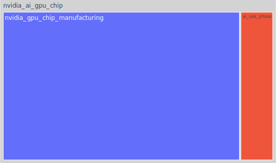

# Appa Run basics

This section describes some basic uses of Appa Run to run an impact model.
The code and files presented in this section can be found in the `samples/` directory of Appa Run source code.
Other usages are presented in section [Appa Run in depth](../in_depth/appa_run_in_depth.md).

## Get FU scores

The most basic operation with impact models can be to compute FU impact scores with a set of parameters.
### Using CLI

To use the CLI, parameter values must be specified in a yaml file.
The next example is a parameter file for the nvidia_ai_gpu_chip sample impact model.
You can click on the  to get information about each field.

:::{code-block} yaml
:caption: samples/conf/parameters.yaml
:lineno-start: 1

lifespan: 3 #(1)!
architecture: Maxwell #(2)!
cuda_core: [256, 512, 1024] #(3)!
energy_per_inference: [0.05, 0.06, 0.065] #(4)!
:::

1. Float type parameter
2. Enum type parameter. The value must match with one of the possible options.
3. Parameters (float and enum) can also be given as a list, which will give a set of scores for each set of parameters. When list parameters coexist with single value parameters as, in this example, the single value is duplicated to the size of the list parameters. 
4. When you use two list parameters, their size should match.

The following command calculates the scores. You need to tell Appa Run where the impact models are stored by setting the `APPARUN_IMPACT_MODELS_DIR` environment variable (here, to `samples/`).

```
apparun compute nvidia_ai_gpu_chip samples/conf/parameters.yaml --output-file-path outputs/scores.yaml
```

The `compute` argument corresponds to the name of the command. `nvidia_ai_gpu_chip`.
The second argument is the impact model name (without file extension).
The third argument is the file containing the parameter values.
Finally, `--output-file-path outputs/scores.yaml` is an optional argument to save the results to a file.

Here is what the command should print (and optionally save):

```
{'scores': {'EFV3_CLIMATE_CHANGE': [6.814605183702477, 23.409114107243994, 124.77822686500075]}}
```

### Using Python API

The equivalent using the Python API is as follows, and should produce the same result:

:::{code-block} python
:caption: samples/conf/parameters.yaml
:lineno-start: 1

scores = impact_model.get_scores(lifespan=3,
                                 architecture="Maxwell",
                                 cuda_core=[256, 512, 1024],
                                 energy_per_inference=[0.05, 0.06, 0.065])
print(scores)
:::

## Get nodes scores

If you set the flag `include_in_tree` to `True` in some activities used by the FU when constructing the impact model with Appa Build, you should have an impact model with different nodes organized as a tree.
You can calculate the scores on all nodes of your impact model in a similar way. This can be useful to break down impacts to life cycle phases or on subcomponents of the system.

In our sample model, we have intermediate nodes on an `ai_use_phase` and a `nvidia_gpu_die_manufacturing` node.

### Using CLI

The usage is really similar to the `apparun compute` command except that we use `apparun compute-nodes`: 

```
apparun compute-nodes nvidia_ai_gpu_chip samples/conf/parameters.yaml --output-file-path outputs/scores.yaml
```

Result:
```
[NodeScores(name='ai_use_phase', parent='nvidia_ai_gpu_chip', properties=NodeProperties(properties={}), lcia_scores=LCIAScores(scores={'EFV3_CLIMATE_CHANGE': [1.420092, 1.7041104000000002, 1.8461196000000002]})), NodeScores(name='nvidia_gpu_chip_manufacturing', parent='nvidia_ai_gpu_chip', properties=NodeProperties(properties={}), lcia_scores=LCIAScores(scores={'EFV3_CLIMATE_CHANGE': [6.742999152294716, 23.323186869554682, 124.68513902417065]})), NodeScores(name='nvidia_ai_gpu_chip', parent='', properties=NodeProperties(properties={}), lcia_scores=LCIAScores(scores={'EFV3_CLIMATE_CHANGE': [8.163091152294715, 25.027297269554683, 126.53125862417065]}))]
```


### Using Python API

The equivalent using the Python API is as follows, and should produce the same result:

:::{code-block} python
:caption: samples/scripts/python_api_usage.py
:lineno-start: 1

nodes_scores = impact_model.get_nodes_scores(lifespan=3,
                                             architecture="Maxwell",
                                             cuda_core=[256, 512, 1024],
                                             energy_per_inference=[0.05, 0.06, 0.065])
print(nodes_scores)
:::

## Generate uncertainty plots and tables

Appa Run comes with a number of ready-to-use results, such as tree map or Sankey plots, or Sobol index calculations.
These results can typically output a table containing all the values necessary to generate a plot, as well as a ready-to-use result.

In this example, we will illustrate how to use an already implemented result to generate a tree map.

### Using CLI

First we need a configuration file to tell Appa Run some information about the results to generate.
You can click on the  to get information about each field.

:::{code-block} yaml
:caption: samples/conf/all_results.yaml
:lineno-start: 1

- result_name: tree_map #(1)!
  args:
    impact_model:
      name: nvidia_ai_gpu_chip #(2)!
      parameters: #(3)!
        architecture: "Maxwell"
        cuda_core: 512
    output_name: nvidia_ai_gpu_chip-Maxwell_512-tree_map #(4)!
    html_save_path: "outputs/figures/" #(5)!
    pdf_save_path: "outputs/figures/" #(6)!
    table_save_path: "outputs/tables/" #(7)!
    png_save_path: "outputs/figures/" #(8)!
    width: 1000 #(9)!
    height: 700 #(10)!
:::

1. Name of the result class. All options are covered in the [Appa Run in depth](../in_depth/appa_run_in_depth.md) section.
2. Name of the impact model to load and run.
3. You can optionally specify new parameter values if you don't like the default values included in the impact model.
4. Root name used for the output files (files and figures).
5. Path to save plots as html file. If this argument is not set, not html file will be generated.
6. Path to save plots as a pdf file. If this argument is not set, not pdf file will be generated.
7. Path to save the table. If this argument is not set, not table file will be generated.
8. Path to save plots as a png file. If this argument is not set, not png file will be generated.
10. Height of the generated images.

Here is a figure we can obtain:

<figure>
  
  <figcaption>Tree map result for the sample case. The area of each box corresponds to its relative contribution to climate change.</figcaption>
</figure>

### Using Python API

The same figure can be generated using the Python API:

:::{code-block} python
:caption: samples/scripts/python_api_usage.py
:lineno-start: 1

tree_map_result = get_result("tree_map")(
    impact_model=impact_model,
    output_name="tree_map",
    pdf_save_path=os.path.join(OUTPUT_FILES_PATH, "figures/"),
    table_save_path=os.path.join(OUTPUT_FILES_PATH, "tables/"),
    html_save_path=os.path.join(OUTPUT_FILES_PATH, "figures/"),
)
tree_map_table = tree_map_result.get_table()
tree_map_result.get_figure(tree_map_table)
:::

If the default values of your impact model don't match the tree map you want to generate, you can update them by calling the following method first:

```
impact_model.parameters.update_defaults({"cuda_core": 256, "architecture": "Maxwell"})
```
