# Appa Build in depth

## Find activity by search in exchanges

EcoInvent datasets in Brightway are identified by a random code (uuid).
To find the code of the desired dataset, one solution can be to use the Activity Browser to search for it manually.

``` { .yaml linenums="1" title="electricity.yaml" }
exchanges:
- database: user_database
  name: electricity
  type: technosphere
  amount: 1
  switch:
    name: usage_location
    options:
    - name: EU
      input:
        uuid: 6f3bff7be2bf2f55a7afd206b7512bfd
        database: ecoinvent_3.9.1_cutoff
    - name: FR
      input:
        uuid: 3463ba8aaa04e2999e8bc0361df969be
        database: ecoinvent_3.9.1_cutoff
```

Since this can be tedious and error-prone, Appa Build allows to dynamically search for activities using regular expressions for the activity fields.
The set of regexes should return exactly one activity.
The following example is equivalent to the previous one.
It looks for an activity that matches a regex for the name, and a strict match for the location.

``` { .yaml linenums="1" title="electricity.yaml" }
exchanges:
- database: user_database
  name: electricity
  type: technosphere
  amount: 1
  switch:
    name: usage_location
    options:
    - name: EU
      input:
        name: "market (group )?for electricity, low voltage"
        location: "RER"
        database: ecoinvent_3.9.1_cutoff
    - name: FR
      input:
        name: "market (group )?for electricity, low voltage"
        location: "FR"
        database: ecoinvent_3.9.1_cutoff
```

## Parameters propagation
Performing a screening LCA of a low TRL technology may require the use of generic data sets that can be parameterized and/or modularized.
This feature is typically available in most LCA software, including Brightway and lca\_algebraic.

In Appa Build we build on this feature to include the notion of parameter propagation.
In short, it allows to influence the parameterization of a downstream dataset in an upstream dataset.
For example, a `nvidia_gpu_chip` dataset could:

- Set the `fab_location` parameter used in a downstream `wafer production` dataset to a specific value.
- Replace the `area` parameter used in a downstream `die production` dataset with a formula function of `cuda_core`.
- Rename a `leads` parameter used in a downstream `package production` dataset to `io`.

The new parameters used when manipulating this `nvidia_gpu_chip` dataset could then be modified again by different FU datasets in the context of different LCA, in order to always have the more appropriate set of parameters in the impact models, which recursively affect the parameterization of all mobilized datasets.
This mechanism allows to define very generic datasets at the leaves that are common to most of your LCAs, to progressively more specialized datasets the closer you get to the datasets that represent the different FUs of your LCAs.

Let's look at the structure of the example LCA:

{ width="500" }
/// caption
Diagram of the datasets and corresponding parameterization used in Appa Build to generate the example impact model. 
///

The `logic_wafer_manufacturing` dataset is generic and is parameterized by two parameters: _fab\_location_ and _masks_.

``` { .yaml linenums="1" title="logic_wafer_manufacturing.yaml" }
parameters:
- fab_location
- masks
exchanges:
- database: user_database
  name: cmos_wafer_production
  type: technosphere
  switch:
    name: fab_location
    options:
    - name: TW
      amount: "(0.049*masks + 0.3623) * 3.14159 * pow(15, 2)" # impact originally is per cm², and we want it per 300 mm wafer
  input:
    database: impact_proxies
    uuid: "('EF v3.0', 'climate change', 'global warming potential (GWP100)')_technosphere_proxy"
```

It is used as input to the `logic_die_manufacturing`, which introduces a new _area_ parameter in addition of the two parameters required by the wafer dataset.

``` { .yaml linenums="1" title="logic_die_manufacturing.yaml" }
parameters:
- area
- fab_location
- masks
exchanges:
- database: user_database
  name: cmos_die_production
  type: technosphere
  amount: "1/(300*3.14159*((300/(4*area))-(1/(sqrt(2*area)))))"
  input:
    database: user_database
    uuid: logic_wafer_manufacturing
```

It is used as input to the `functional_logic_die_manufacturing` data set, which introduces the _defect\_density_ parameter to model the yield.
It also takes advantage of the parameter matching feature to replace the _masks_ parameter with a function of _technology\_node_.
As a result, to use the `functional_logic_die_manufacturing`, you don't need the _masks_ parameter anymore, but _technology\_node_ instead.
In the context of embedded AI ecodesign, using technology node can be interesting because it is an information more easily accessible to embedded AI designers than the number of lithography masks, and the first can be used to estimate the second.

``` { .yaml linenums="1" title="functional_logic_die_manufacturing.yaml" }
parameters:
- area
- defect_density # defect/mm²
- fab_location
- technology_node
exchanges:
- database: user_database
  name: functional_cmos_die_production
  type: technosphere
  amount: "1/pow((1-exp(-defect_density*area))/(defect_density*area), 2)"
  parameters_matching:
    masks: "137.24 * pow(technology_node, -0.317)"
  input:
    database: user_database
    uuid: logic_die_manufacturing
```

It is used as input to the `nvidia_gpu_die_manufacturing` dataset.
This dataset is highly specialized. Nvidia GPU dies of interest can be defined by their _architecture_ and number of _cuda\_core_.
For the two architectures of interest, we can set the _fab_location_ parameter to the _TW_ value, and the _technology\_node_ and _defect\_density_ parameters.
The _area_ can also be reasonably estimated by the number of _cuda\_core_ for both architectures.

``` { .yaml linenums="1" title="nvidia_gpu_die_manufacturing.yaml" }
parameters:
- cuda_core
- architecture
exchanges:
- database: user_database
  name: logic_die
  type: technosphere
  amount: 1
  switch:
    name: architecture
    options:
    - name: Pascal
      parameters_matching:
        defect_density: 0.05
        technology_node: 16 # is actually 14 for 2 chips, and 16 for 4 chips.
        fab_location:
          TW: 1
        area: 0.13184623155305694*cuda_core + 21.707425626610416
    - name: Maxwell # also includes Maxwell 2.0
      parameters_matching:
        defect_density: 0.02
        technology_node: 28
        fab_location:
          TW: 1
        area: 0.1889809692866578*cuda_core + 19.47688243064738
  input:
    database: user_database
    uuid: functional_logic_die_manufacturing

```

Now, the user will only has to specify the _cuda\_core_ and _architecture_ parameters to parameterize the impacts of the embedded Nvidia AI accelerator manufacturing.

!!! info 

    It is important to note that the same dataset can be used in multiple exchanges with different parameterizations. 

!!! info "Rename a parameter"

    Parameter\_matching can be used to rename a parameter. Simply specify the new parameter name instead of a value or formula. Note that, to date, Enum parameters cannot be renamed.


## Import data at the impact level

### Motivations
Importing dataset at the impact level can be useful if only impact data are provided by the source and no LCI data, or if you are trying to import data from a database that is not supported by Brightway.
In the second case, LCI data (i.e. data at the elementary flow level) exist but are difficult to connect to Brightway mainly due to the fact that elementary flows are not consistent between LCIA methods, LCI databases and LCA software.
This issue has been discussed in details[^1].
In a nutshell, elementary flows are named and classified differently in different sources. Matching them all together, and matching them with characterization factors is a task that cannot reasonably be done manually as there are hundreds, if not thousands of them[^2].
A unified elementary flow list has been proposed[^3], but has not been widely implemented yet. In the meantime, importing data at the impact level may be an interesting workaround. 

### Limits
The first and most obvious limitation is that any valuable information in the data at the elementary flow level is lost.
You wouldn't be able to tell which greenhouse gas emission is responsible for the climate change impact of your data if you imported it at the impact level.

Second limitation is that since the impacts are calculated by different software than Brightway, there could be inconsistencies as different software cannot calculate the same impacts despite using the same LCIA methods[^4].

The third limitation is that you must have the impact data calculated using the LCIA methods of your choice.
If you intend to use EF v3.1 impacts in your LCA, you will need to find EF v3.1 impacts for all of your data imported at the impact level, and you will need to cover all the required indicators.

!!! warning 

    Be careful not to run your LCA with indicators that are not covered in all of your imported data at the impact level, or you will underestimate the impacts in your impact model.
    We plan to add a warning when building the impact model in this case. 


### How to do it manually with Appa Build?

Appa Build generates a set of impact proxies at startup.
Impact proxies are datasets used to generate impacts without communicating with real biosphere flows and characterization factors.
One impact proxy is generated for each LCIA method.
The name of the impact proxy is `{bw_method_name}_technosphere_proxy` where `{bw_method_name}` is the name of the LCIA method in Brightway. 
The list of available `bw_method_name` is as follows:

??? note "List of Brightway LCIA method names"

    ('CML v4.8 2016 no LT', 'acidification no LT', 'acidification (incl. fate, average Europe total, A&B) no LT'),  
    ('CML v4.8 2016 no LT', 'climate change no LT', 'global warming potential (GWP100) no LT'),  
    ('CML v4.8 2016 no LT', 'ecotoxicity: freshwater no LT', 'freshwater aquatic ecotoxicity (FAETP inf) no LT'),  
    ('CML v4.8 2016 no LT', 'ecotoxicity: marine no LT', 'marine aquatic ecotoxicity (MAETP inf) no LT'),  
    ('CML v4.8 2016 no LT', 'ecotoxicity: terrestrial no LT', 'terrestrial ecotoxicity (TETP inf) no LT'),  
    ('CML v4.8 2016 no LT', 'energy resources: non-renewable no LT', 'abiotic depletion potential (ADP): fossil fuels no LT'),  
    ('CML v4.8 2016 no LT', 'eutrophication no LT', 'eutrophication (fate not incl.) no LT'),  
    ('CML v4.8 2016 no LT', 'human toxicity no LT', 'human toxicity (HTP inf) no LT'),  
    ('CML v4.8 2016 no LT', 'material resources: metals/minerals no LT', 'abiotic depletion potential (ADP): elements (ultimate reserves) no LT'),  
    ('CML v4.8 2016 no LT', 'ozone depletion no LT', 'ozone layer depletion (ODP steady state) no LT'),  
    ('CML v4.8 2016 no LT', 'photochemical oxidant formation no LT', 'photochemical oxidation (high NOx) no LT'),  
    ('CML v4.8 2016', 'acidification', 'acidification (incl. fate, average Europe total, A&B)'),  
    ('CML v4.8 2016', 'climate change', 'global warming potential (GWP100)'),  
    ('CML v4.8 2016', 'ecotoxicity: freshwater', 'freshwater aquatic ecotoxicity (FAETP inf)'),  
    ('CML v4.8 2016', 'ecotoxicity: marine', 'marine aquatic ecotoxicity (MAETP inf)'),  
    ('CML v4.8 2016', 'ecotoxicity: terrestrial', 'terrestrial ecotoxicity (TETP inf)'),  
    ('CML v4.8 2016', 'energy resources: non-renewable', 'abiotic depletion potential (ADP): fossil fuels'),  
    ('CML v4.8 2016', 'eutrophication', 'eutrophication (fate not incl.)'),  
    ('CML v4.8 2016', 'human toxicity', 'human toxicity (HTP inf)'),  
    ('CML v4.8 2016', 'material resources: metals/minerals', 'abiotic depletion potential (ADP): elements (ultimate reserves)'),  
    ('CML v4.8 2016', 'ozone depletion', 'ozone layer depletion (ODP steady state)'),  
    ('CML v4.8 2016', 'photochemical oxidant formation', 'photochemical oxidation (high NOx)'),  
    ('Crustal Scarcity Indicator 2020', 'material resources: metals/minerals', 'crustal scarcity potential (CSP)'),  
    ('Cumulative Energy Demand (CED)', 'energy resources: non-renewable', 'energy content (HHV)'),  
    ('Cumulative Energy Demand (CED)', 'energy resources: non-renewable, biomass', 'energy content (HHV)'),  
    ('Cumulative Energy Demand (CED)', 'energy resources: non-renewable, fossil', 'energy content (HHV)'),  
    ('Cumulative Energy Demand (CED)', 'energy resources: non-renewable, nuclear', 'energy content (HHV)'),  
    ('Cumulative Energy Demand (CED)', 'energy resources: renewable', 'energy content (HHV)'),  
    ('Cumulative Energy Demand (CED)', 'energy resources: renewable, biomass', 'energy content (HHV)'),  
    ('Cumulative Energy Demand (CED)', 'energy resources: renewable, geothermal', 'energy content (HHV)'),  
    ('Cumulative Energy Demand (CED)', 'energy resources: renewable, geothermal, solar, wind', 'energy content (HHV)'),  
    ('Cumulative Energy Demand (CED)', 'energy resources: renewable, solar', 'energy content (HHV)'),  
    ('Cumulative Energy Demand (CED)', 'energy resources: renewable, water', 'energy content (HHV)'),  
    ('Cumulative Energy Demand (CED)', 'energy resources: renewable, wind', 'energy content (HHV)'),  
    ('Cumulative Energy Demand (CED)', 'total', 'energy content (HHV)'),  
    ('Cumulative Exergy Demand (CExD)', 'energy resources: non-renewable', 'exergy content'),  
    ('Cumulative Exergy Demand (CExD)', 'energy resources: non-renewable, biomass', 'exergy content'),  
    ('Cumulative Exergy Demand (CExD)', 'energy resources: non-renewable, fossil', 'exergy content'),  
    ('Cumulative Exergy Demand (CExD)', 'energy resources: non-renewable, nuclear', 'exergy content'),  
    ('Cumulative Exergy Demand (CExD)', 'energy resources: renewable', 'exergy content'),  
    ('Cumulative Exergy Demand (CExD)', 'energy resources: renewable, biomass', 'exergy content'),  
    ('Cumulative Exergy Demand (CExD)', 'energy resources: renewable, solar', 'exergy content'),  
    ('Cumulative Exergy Demand (CExD)', 'energy resources: renewable, water', 'exergy content'),  
    ('Cumulative Exergy Demand (CExD)', 'energy resources: renewable, wind', 'exergy content'),  
    ('Cumulative Exergy Demand (CExD)', 'material resources', 'exergy content'),  
    ('Cumulative Exergy Demand (CExD)', 'material resources: metals', 'exergy content'),  
    ('Cumulative Exergy Demand (CExD)', 'material resources: minerals', 'exergy content'),  
    ('Cumulative Exergy Demand (CExD)', 'material resources: water', 'exergy content'),  
    ('Cumulative Exergy Demand (CExD)', 'total', 'exergy content'),  
    ('Ecological Footprint', 'CO2', 'global hectares'),  
    ('Ecological Footprint', 'land occupation', 'global hectares'),  
    ('Ecological Footprint', 'nuclear', 'global hectares'),  
    ('Ecological Footprint', 'total', 'global hectares'),  
    ('Ecological Scarcity 2021 no LT', 'climate change no LT', 'global warming potential (GWP100) no LT'),  
    ('Ecological Scarcity 2021 no LT', 'emissions to air no LT', 'air pollutants and PM no LT'),  
    ('Ecological Scarcity 2021 no LT', 'emissions to air no LT', 'carcinogenic substances into air no LT'),  
    ('Ecological Scarcity 2021 no LT', 'emissions to air no LT', 'heavy metals into air no LT'),  
    ('Ecological Scarcity 2021 no LT', 'emissions to air no LT', 'radioactive substances into air no LT'),  
    ('Ecological Scarcity 2021 no LT', 'emissions to soil no LT', 'heavy metals into soil no LT'),  
    ('Ecological Scarcity 2021 no LT', 'emissions to soil no LT', 'pesticides into soil no LT'),  
    ('Ecological Scarcity 2021 no LT', 'emissions to water no LT', 'heavy metals into water no LT'),  
    ('Ecological Scarcity 2021 no LT', 'emissions to water no LT', 'POP into water no LT'),  
    ('Ecological Scarcity 2021 no LT', 'emissions to water no LT', 'radioactive substances into water no LT'),  
    ('Ecological Scarcity 2021 no LT', 'emissions to water no LT', 'water pollutants no LT'),  
    ('Ecological Scarcity 2021 no LT', 'energy resources no LT', 'energy resources no LT'),  
    ('Ecological Scarcity 2021 no LT', 'land use no LT', 'land use no LT'),  
    ('Ecological Scarcity 2021 no LT', 'mineral resources no LT', 'mineral resources no LT'),  
    ('Ecological Scarcity 2021 no LT', 'natural resources no LT', 'biotic resources no LT'),  
    ('Ecological Scarcity 2021 no LT', 'ozone depletion no LT', 'ozone depletion no LT'),  
    ('Ecological Scarcity 2021 no LT', 'total no LT', 'UBP no LT'),  
    ('Ecological Scarcity 2021 no LT', 'waste disposal no LT', 'radioactive waste to deposit no LT'),  
    ('Ecological Scarcity 2021 no LT', 'waste disposal no LT', 'waste, non radioactive no LT'),  
    ('Ecological Scarcity 2021 no LT', 'water use no LT', 'water resources, evaporated no LT'),  
    ('Ecological Scarcity 2021', 'climate change', 'global warming potential (GWP100)'),  
    ('Ecological Scarcity 2021', 'emissions to air', 'air pollutants and PM'),  
    ('Ecological Scarcity 2021', 'emissions to air', 'carcinogenic substances into air'),  
    ('Ecological Scarcity 2021', 'emissions to air', 'heavy metals into air'),  
    ('Ecological Scarcity 2021', 'emissions to air', 'radioactive substances into air'),  
    ('Ecological Scarcity 2021', 'emissions to soil', 'heavy metals into soil'),  
    ('Ecological Scarcity 2021', 'emissions to soil', 'pesticides into soil'),  
    ('Ecological Scarcity 2021', 'emissions to water', 'heavy metals into water'),  
    ('Ecological Scarcity 2021', 'emissions to water', 'POP into water'),  
    ('Ecological Scarcity 2021', 'emissions to water', 'radioactive substances into water'),  
    ('Ecological Scarcity 2021', 'emissions to water', 'water pollutants'),  
    ('Ecological Scarcity 2021', 'energy resources', 'energy resources'),  
    ('Ecological Scarcity 2021', 'land use', 'land use'),  
    ('Ecological Scarcity 2021', 'mineral resources', 'mineral resources'),  
    ('Ecological Scarcity 2021', 'natural resources', 'biotic resources'),  
    ('Ecological Scarcity 2021', 'ozone depletion', 'ozone depletion'),  
    ('Ecological Scarcity 2021', 'total', 'UBP'),  
    ('Ecological Scarcity 2021', 'waste disposal', 'radioactive waste to deposit'),  
    ('Ecological Scarcity 2021', 'waste disposal', 'waste, non radioactive'),  
    ('Ecological Scarcity 2021', 'water use', 'water resources, evaporated'),  
    ('Ecosystem Damage Potential', 'land occupation', 'ecosystem damage potential'),  
    ('Ecosystem Damage Potential', 'land transformation', 'ecosystem damage potential'),  
    ('Ecosystem Damage Potential', 'total', 'ecosystem damage potential'),  
    ('EDIP 2003 no LT', 'acidification no LT', 'acidification no LT'),  
    ('EDIP 2003 no LT', 'ecotoxicity no LT', 'acute, in water no LT'),  
    ('EDIP 2003 no LT', 'ecotoxicity no LT', 'chronic, in soil no LT'),  
    ('EDIP 2003 no LT', 'ecotoxicity no LT', 'chronic, in water no LT'),  
    ('EDIP 2003 no LT', 'ecotoxicity no LT', 'in sewage treatment plants no LT'),  
    ('EDIP 2003 no LT', 'eutrophication no LT', 'combined potential no LT'),  
    ('EDIP 2003 no LT', 'eutrophication no LT', 'separate N potential no LT'),  
    ('EDIP 2003 no LT', 'eutrophication no LT', 'separate P potential no LT'),  
    ('EDIP 2003 no LT', 'eutrophication no LT', 'terrestrial eutrophication no LT'),  
    ('EDIP 2003 no LT', 'global warming no LT', 'GWP 100a no LT'),  
    ('EDIP 2003 no LT', 'global warming no LT', 'GWP 20a no LT'),  
    ('EDIP 2003 no LT', 'global warming no LT', 'GWP 500a no LT'),  
    ('EDIP 2003 no LT', 'human toxicity no LT', 'via air no LT'),  
    ('EDIP 2003 no LT', 'human toxicity no LT', 'via soil no LT'),  
    ('EDIP 2003 no LT', 'human toxicity no LT', 'via surface water no LT'),  
    ('EDIP 2003 no LT', 'land filling no LT', 'bulk waste no LT'),  
    ('EDIP 2003 no LT', 'land filling no LT', 'hazardous waste no LT'),  
    ('EDIP 2003 no LT', 'land filling no LT', 'radioactive waste no LT'),  
    ('EDIP 2003 no LT', 'land filling no LT', 'slag and ashes no LT'),  
    ('EDIP 2003 no LT', 'non-renewable resources no LT', 'aluminium no LT'),  
    ('EDIP 2003 no LT', 'non-renewable resources no LT', 'antimony no LT'),  
    ('EDIP 2003 no LT', 'non-renewable resources no LT', 'brown coal no LT'),  
    ('EDIP 2003 no LT', 'non-renewable resources no LT', 'cadmium no LT'),  
    ('EDIP 2003 no LT', 'non-renewable resources no LT', 'cerium no LT'),  
    ('EDIP 2003 no LT', 'non-renewable resources no LT', 'coal no LT'),  
    ('EDIP 2003 no LT', 'non-renewable resources no LT', 'cobalt no LT'),  
    ('EDIP 2003 no LT', 'non-renewable resources no LT', 'copper no LT'),  
    ('EDIP 2003 no LT', 'non-renewable resources no LT', 'gold no LT'),  
    ('EDIP 2003 no LT', 'non-renewable resources no LT', 'iron no LT'),  
    ('EDIP 2003 no LT', 'non-renewable resources no LT', 'lanthanum no LT'),  
    ('EDIP 2003 no LT', 'non-renewable resources no LT', 'lead no LT'),  
    ('EDIP 2003 no LT', 'non-renewable resources no LT', 'manganese no LT'),  
    ('EDIP 2003 no LT', 'non-renewable resources no LT', 'mercury no LT'),  
    ('EDIP 2003 no LT', 'non-renewable resources no LT', 'molybdenum no LT'),  
    ('EDIP 2003 no LT', 'non-renewable resources no LT', 'natural gas no LT'),  
    ('EDIP 2003 no LT', 'non-renewable resources no LT', 'nickel no LT'),  
    ('EDIP 2003 no LT', 'non-renewable resources no LT', 'oil no LT'),  
    ('EDIP 2003 no LT', 'non-renewable resources no LT', 'palladium no LT'),  
    ('EDIP 2003 no LT', 'non-renewable resources no LT', 'platinum no LT'),  
    ('EDIP 2003 no LT', 'non-renewable resources no LT', 'silver no LT'),  
    ('EDIP 2003 no LT', 'non-renewable resources no LT', 'tantalum no LT'),  
    ('EDIP 2003 no LT', 'non-renewable resources no LT', 'tin no LT'),  
    ('EDIP 2003 no LT', 'non-renewable resources no LT', 'zinc no LT'),  
    ('EDIP 2003 no LT', 'photochemical ozone formation no LT', 'impacts on human health no LT'),  
    ('EDIP 2003 no LT', 'photochemical ozone formation no LT', 'impacts on vegetation no LT'),  
    ('EDIP 2003 no LT', 'renewable resources no LT', 'wood no LT'),  
    ('EDIP 2003 no LT', 'stratospheric ozone depletion no LT', 'ODP total no LT'),  
    ('EDIP 2003', 'acidification', 'acidification'),  
    ('EDIP 2003', 'ecotoxicity', 'acute, in water'),  
    ('EDIP 2003', 'ecotoxicity', 'chronic, in soil'),  
    ('EDIP 2003', 'ecotoxicity', 'chronic, in water'),  
    ('EDIP 2003', 'ecotoxicity', 'in sewage treatment plants'),  
    ('EDIP 2003', 'eutrophication', 'combined potential'),  
    ('EDIP 2003', 'eutrophication', 'separate N potential'),  
    ('EDIP 2003', 'eutrophication', 'separate P potential'),  
    ('EDIP 2003', 'eutrophication', 'terrestrial eutrophication'),  
    ('EDIP 2003', 'global warming', 'GWP 100a'),  
    ('EDIP 2003', 'global warming', 'GWP 20a'),  
    ('EDIP 2003', 'global warming', 'GWP 500a'),  
    ('EDIP 2003', 'human toxicity', 'via air'),  
    ('EDIP 2003', 'human toxicity', 'via soil'),  
    ('EDIP 2003', 'human toxicity', 'via surface water'),  
    ('EDIP 2003', 'land filling', 'bulk waste'),  
    ('EDIP 2003', 'land filling', 'hazardous waste'),  
    ('EDIP 2003', 'land filling', 'radioactive waste'),  
    ('EDIP 2003', 'land filling', 'slag and ashes'),  
    ('EDIP 2003', 'non-renewable resources', 'aluminium'),  
    ('EDIP 2003', 'non-renewable resources', 'antimony'),  
    ('EDIP 2003', 'non-renewable resources', 'brown coal'),  
    ('EDIP 2003', 'non-renewable resources', 'cadmium'),  
    ('EDIP 2003', 'non-renewable resources', 'cerium'),  
    ('EDIP 2003', 'non-renewable resources', 'coal'),  
    ('EDIP 2003', 'non-renewable resources', 'cobalt'),  
    ('EDIP 2003', 'non-renewable resources', 'copper'),  
    ('EDIP 2003', 'non-renewable resources', 'gold'),  
    ('EDIP 2003', 'non-renewable resources', 'iron'),  
    ('EDIP 2003', 'non-renewable resources', 'lanthanum'),  
    ('EDIP 2003', 'non-renewable resources', 'lead'),  
    ('EDIP 2003', 'non-renewable resources', 'manganese'),  
    ('EDIP 2003', 'non-renewable resources', 'mercury'),  
    ('EDIP 2003', 'non-renewable resources', 'molybdenum'),  
    ('EDIP 2003', 'non-renewable resources', 'natural gas'),  
    ('EDIP 2003', 'non-renewable resources', 'nickel'),  
    ('EDIP 2003', 'non-renewable resources', 'oil'),  
    ('EDIP 2003', 'non-renewable resources', 'palladium'),  
    ('EDIP 2003', 'non-renewable resources', 'platinum'),  
    ('EDIP 2003', 'non-renewable resources', 'silver'),  
    ('EDIP 2003', 'non-renewable resources', 'tantalum'),  
    ('EDIP 2003', 'non-renewable resources', 'tin'),  
    ('EDIP 2003', 'non-renewable resources', 'zinc'),  
    ('EDIP 2003', 'photochemical ozone formation', 'impacts on human health'),  
    ('EDIP 2003', 'photochemical ozone formation', 'impacts on vegetation'),  
    ('EDIP 2003', 'renewable resources', 'wood'),  
    ('EDIP 2003', 'stratospheric ozone depletion', 'ODP total'),  
    ('EF v3.0 no LT', 'acidification no LT', 'accumulated exceedance (AE) no LT'),  
    ('EF v3.0 no LT', 'climate change no LT', 'global warming potential (GWP100) no LT'),  
    ('EF v3.0 no LT', 'climate change: biogenic no LT', 'global warming potential (GWP100) no LT'),  
    ('EF v3.0 no LT', 'climate change: fossil no LT', 'global warming potential (GWP100) no LT'),  
    ('EF v3.0 no LT', 'climate change: land use and land use change no LT', 'global warming potential (GWP100) no LT'),  
    ('EF v3.0 no LT', 'ecotoxicity: freshwater no LT', 'comparative toxic unit for ecosystems (CTUe) no LT'),  
    ('EF v3.0 no LT', 'ecotoxicity: freshwater, inorganics no LT', 'comparative toxic unit for ecosystems (CTUe) no LT'),  
    ('EF v3.0 no LT', 'ecotoxicity: freshwater, metals no LT', 'comparative toxic unit for ecosystems (CTUe) no LT'),  
    ('EF v3.0 no LT', 'ecotoxicity: freshwater, organics no LT', 'comparative toxic unit for ecosystems (CTUe) no LT'),  
    ('EF v3.0 no LT', 'energy resources: non-renewable no LT', 'abiotic depletion potential (ADP): fossil fuels no LT'),  
    ('EF v3.0 no LT', 'eutrophication: freshwater no LT', 'fraction of nutrients reaching freshwater end compartment (P) no LT'),  
    ('EF v3.0 no LT', 'eutrophication: marine no LT', 'fraction of nutrients reaching marine end compartment (N) no LT'),  
    ('EF v3.0 no LT', 'eutrophication: terrestrial no LT', 'accumulated exceedance (AE) no LT'),  
    ('EF v3.0 no LT', 'human toxicity: carcinogenic no LT', 'comparative toxic unit for human (CTUh) no LT'),  
    ('EF v3.0 no LT', 'human toxicity: carcinogenic, inorganics no LT', 'comparative toxic unit for human (CTUh) no LT'),  
    ('EF v3.0 no LT', 'human toxicity: carcinogenic, metals no LT', 'comparative toxic unit for human (CTUh) no LT'),  
    ('EF v3.0 no LT', 'human toxicity: carcinogenic, organics no LT', 'comparative toxic unit for human (CTUh) no LT'),  
    ('EF v3.0 no LT', 'human toxicity: non-carcinogenic no LT', 'comparative toxic unit for human (CTUh) no LT'),  
    ('EF v3.0 no LT', 'human toxicity: non-carcinogenic, inorganics no LT', 'comparative toxic unit for human (CTUh) no LT'),  
    ('EF v3.0 no LT', 'human toxicity: non-carcinogenic, metals no LT', 'comparative toxic unit for human (CTUh) no LT'),  
    ('EF v3.0 no LT', 'human toxicity: non-carcinogenic, organics no LT', 'comparative toxic unit for human (CTUh) no LT'),  
    ('EF v3.0 no LT', 'ionising radiation: human health no LT', 'human exposure efficiency relative to u235 no LT'),  
    ('EF v3.0 no LT', 'land use no LT', 'soil quality index no LT'),  
    ('EF v3.0 no LT', 'material resources: metals/minerals no LT', 'abiotic depletion potential (ADP): elements (ultimate reserves) no LT'),  
    ('EF v3.0 no LT', 'ozone depletion no LT', 'ozone depletion potential (ODP) no LT'),  
    ('EF v3.0 no LT', 'particulate matter formation no LT', 'impact on human health no LT'),  
    ('EF v3.0 no LT', 'photochemical oxidant formation: human health no LT', 'tropospheric ozone concentration increase no LT'),  
    ('EF v3.0 no LT', 'water use no LT', 'user deprivation potential (deprivation-weighted water consumption) no LT'),  
    ('EF v3.0', 'acidification', 'accumulated exceedance (AE)'),  
    ('EF v3.0', 'climate change', 'global warming potential (GWP100)'),  
    ('EF v3.0', 'climate change: biogenic', 'global warming potential (GWP100)'),  
    ('EF v3.0', 'climate change: fossil', 'global warming potential (GWP100)'),  
    ('EF v3.0', 'climate change: land use and land use change', 'global warming potential (GWP100)'),  
    ('EF v3.0', 'ecotoxicity: freshwater', 'comparative toxic unit for ecosystems (CTUe)'),  
    ('EF v3.0', 'ecotoxicity: freshwater, inorganics', 'comparative toxic unit for ecosystems (CTUe)'),  
    ('EF v3.0', 'ecotoxicity: freshwater, metals', 'comparative toxic unit for ecosystems (CTUe)'),  
    ('EF v3.0', 'ecotoxicity: freshwater, organics', 'comparative toxic unit for ecosystems (CTUe)'),  
    ('EF v3.0', 'energy resources: non-renewable', 'abiotic depletion potential (ADP): fossil fuels'),  
    ('EF v3.0', 'eutrophication: freshwater', 'fraction of nutrients reaching freshwater end compartment (P)'),  
    ('EF v3.0', 'eutrophication: marine', 'fraction of nutrients reaching marine end compartment (N)'),  
    ('EF v3.0', 'eutrophication: terrestrial', 'accumulated exceedance (AE)'),  
    ('EF v3.0', 'human toxicity: carcinogenic', 'comparative toxic unit for human (CTUh)'),  
    ('EF v3.0', 'human toxicity: carcinogenic, inorganics', 'comparative toxic unit for human (CTUh)'),  
    ('EF v3.0', 'human toxicity: carcinogenic, metals', 'comparative toxic unit for human (CTUh)'),  
    ('EF v3.0', 'human toxicity: carcinogenic, organics', 'comparative toxic unit for human (CTUh)'),  
    ('EF v3.0', 'human toxicity: non-carcinogenic', 'comparative toxic unit for human (CTUh)'),  
    ('EF v3.0', 'human toxicity: non-carcinogenic, inorganics', 'comparative toxic unit for human (CTUh)'),  
    ('EF v3.0', 'human toxicity: non-carcinogenic, metals', 'comparative toxic unit for human (CTUh)'),  
    ('EF v3.0', 'human toxicity: non-carcinogenic, organics', 'comparative toxic unit for human (CTUh)'),  
    ('EF v3.0', 'ionising radiation: human health', 'human exposure efficiency relative to u235'),  
    ('EF v3.0', 'land use', 'soil quality index'),  
    ('EF v3.0', 'material resources: metals/minerals', 'abiotic depletion potential (ADP): elements (ultimate reserves)'),  
    ('EF v3.0', 'ozone depletion', 'ozone depletion potential (ODP)'),  
    ('EF v3.0', 'particulate matter formation', 'impact on human health'),  
    ('EF v3.0', 'photochemical oxidant formation: human health', 'tropospheric ozone concentration increase'),  
    ('EF v3.0', 'water use', 'user deprivation potential (deprivation-weighted water consumption)'),  
    ('EF v3.1 no LT', 'acidification no LT', 'accumulated exceedance (AE) no LT'),  
    ('EF v3.1 no LT', 'climate change no LT', 'global warming potential (GWP100) no LT'),  
    ('EF v3.1 no LT', 'climate change: biogenic no LT', 'global warming potential (GWP100) no LT'),  
    ('EF v3.1 no LT', 'climate change: fossil no LT', 'global warming potential (GWP100) no LT'),  
    ('EF v3.1 no LT', 'climate change: land use and land use change no LT', 'global warming potential (GWP100) no LT'),  
    ('EF v3.1 no LT', 'ecotoxicity: freshwater no LT', 'comparative toxic unit for ecosystems (CTUe) no LT'),  
    ('EF v3.1 no LT', 'ecotoxicity: freshwater, inorganics no LT', 'comparative toxic unit for ecosystems (CTUe) no LT'),  
    ('EF v3.1 no LT', 'ecotoxicity: freshwater, organics no LT', 'comparative toxic unit for ecosystems (CTUe) no LT'),  
    ('EF v3.1 no LT', 'energy resources: non-renewable no LT', 'abiotic depletion potential (ADP): fossil fuels no LT'),  
    ('EF v3.1 no LT', 'eutrophication: freshwater no LT', 'fraction of nutrients reaching freshwater end compartment (P) no LT'),  
    ('EF v3.1 no LT', 'eutrophication: marine no LT', 'fraction of nutrients reaching marine end compartment (N) no LT'),  
    ('EF v3.1 no LT', 'eutrophication: terrestrial no LT', 'accumulated exceedance (AE) no LT'),  
    ('EF v3.1 no LT', 'human toxicity: carcinogenic no LT', 'comparative toxic unit for human (CTUh) no LT'),  
    ('EF v3.1 no LT', 'human toxicity: carcinogenic, inorganics no LT', 'comparative toxic unit for human (CTUh) no LT'),  
    ('EF v3.1 no LT', 'human toxicity: carcinogenic, organics no LT', 'comparative toxic unit for human (CTUh) no LT'),  
    ('EF v3.1 no LT', 'human toxicity: non-carcinogenic no LT', 'comparative toxic unit for human (CTUh) no LT'),  
    ('EF v3.1 no LT', 'human toxicity: non-carcinogenic, inorganics no LT', 'comparative toxic unit for human (CTUh) no LT'),  
    ('EF v3.1 no LT', 'human toxicity: non-carcinogenic, organics no LT', 'comparative toxic unit for human (CTUh) no LT'),  
    ('EF v3.1 no LT', 'ionising radiation: human health no LT', 'human exposure efficiency relative to u235 no LT'),  
    ('EF v3.1 no LT', 'land use no LT', 'soil quality index no LT'),  
    ('EF v3.1 no LT', 'material resources: metals/minerals no LT', 'abiotic depletion potential (ADP): elements (ultimate reserves) no LT'),  
    ('EF v3.1 no LT', 'ozone depletion no LT', 'ozone depletion potential (ODP) no LT'),  
    ('EF v3.1 no LT', 'particulate matter formation no LT', 'impact on human health no LT'),  
    ('EF v3.1 no LT', 'photochemical oxidant formation: human health no LT', 'tropospheric ozone concentration increase no LT'),  
    ('EF v3.1 no LT', 'water use no LT', 'user deprivation potential (deprivation-weighted water consumption) no LT'),  
    ('EF v3.1', 'acidification', 'accumulated exceedance (AE)'),  
    ('EF v3.1', 'climate change', 'global warming potential (GWP100)'),  
    ('EF v3.1', 'climate change: biogenic', 'global warming potential (GWP100)'),  
    ('EF v3.1', 'climate change: fossil', 'global warming potential (GWP100)'),  
    ('EF v3.1', 'climate change: land use and land use change', 'global warming potential (GWP100)'),  
    ('EF v3.1', 'ecotoxicity: freshwater', 'comparative toxic unit for ecosystems (CTUe)'),  
    ('EF v3.1', 'ecotoxicity: freshwater, inorganics', 'comparative toxic unit for ecosystems (CTUe)'),  
    ('EF v3.1', 'ecotoxicity: freshwater, organics', 'comparative toxic unit for ecosystems (CTUe)'),  
    ('EF v3.1', 'energy resources: non-renewable', 'abiotic depletion potential (ADP): fossil fuels'),  
    ('EF v3.1', 'eutrophication: freshwater', 'fraction of nutrients reaching freshwater end compartment (P)'),  
    ('EF v3.1', 'eutrophication: marine', 'fraction of nutrients reaching marine end compartment (N)'),  
    ('EF v3.1', 'eutrophication: terrestrial', 'accumulated exceedance (AE)'),  
    ('EF v3.1', 'human toxicity: carcinogenic', 'comparative toxic unit for human (CTUh)'),  
    ('EF v3.1', 'human toxicity: carcinogenic, inorganics', 'comparative toxic unit for human (CTUh)'),  
    ('EF v3.1', 'human toxicity: carcinogenic, organics', 'comparative toxic unit for human (CTUh)'),  
    ('EF v3.1', 'human toxicity: non-carcinogenic', 'comparative toxic unit for human (CTUh)'),  
    ('EF v3.1', 'human toxicity: non-carcinogenic, inorganics', 'comparative toxic unit for human (CTUh)'),  
    ('EF v3.1', 'human toxicity: non-carcinogenic, organics', 'comparative toxic unit for human (CTUh)'),  
    ('EF v3.1', 'ionising radiation: human health', 'human exposure efficiency relative to u235'),  
    ('EF v3.1', 'land use', 'soil quality index'),  
    ('EF v3.1', 'material resources: metals/minerals', 'abiotic depletion potential (ADP): elements (ultimate reserves)'),  
    ('EF v3.1', 'ozone depletion', 'ozone depletion potential (ODP)'),  
    ('EF v3.1', 'particulate matter formation', 'impact on human health'),  
    ('EF v3.1', 'photochemical oxidant formation: human health', 'tropospheric ozone concentration increase'),  
    ('EF v3.1', 'water use', 'user deprivation potential (deprivation-weighted water consumption)'),  
    ('EPS 2020d no LT', 'emissions to air no LT', 'monetary impact value no LT'),  
    ('EPS 2020d no LT', 'emissions to soil no LT', 'monetary impact value no LT'),  
    ('EPS 2020d no LT', 'emissions to water no LT', 'monetary impact value no LT'),  
    ('EPS 2020d no LT', 'energy resources: non-renewable, fossil no LT', 'monetary impact value no LT'),  
    ('EPS 2020d no LT', 'land use no LT', 'monetary impact value no LT'),  
    ('EPS 2020d no LT', 'material resources: metals no LT', 'monetary impact value no LT'),  
    ('EPS 2020d no LT', 'total no LT', 'monetary impact value no LT'),  
    ('EPS 2020d', 'emissions to air', 'monetary impact value'),  
    ('EPS 2020d', 'emissions to soil', 'monetary impact value'),  
    ('EPS 2020d', 'emissions to water', 'monetary impact value'),  
    ('EPS 2020d', 'energy resources: non-renewable, fossil', 'monetary impact value'),  
    ('EPS 2020d', 'land use', 'monetary impact value'),  
    ('EPS 2020d', 'material resources: metals', 'monetary impact value'),  
    ('EPS 2020d', 'total', 'monetary impact value'),  
    ('IMPACT 2002+ (Endpoint)', 'climate change', 'climate change'),  
    ('IMPACT 2002+ (Endpoint)', 'climate change', 'total'),  
    ('IMPACT 2002+ (Endpoint)', 'ecosystem quality', 'aquatic ecotoxicity'),  
    ('IMPACT 2002+ (Endpoint)', 'ecosystem quality', 'land occupation'),  
    ('IMPACT 2002+ (Endpoint)', 'ecosystem quality', 'terrestrial acidification & nutrification'),  
    ('IMPACT 2002+ (Endpoint)', 'ecosystem quality', 'terrestrial ecotoxicity'),  
    ('IMPACT 2002+ (Endpoint)', 'ecosystem quality', 'total'),  
    ('IMPACT 2002+ (Endpoint)', 'human health', 'human toxicity'),  
    ('IMPACT 2002+ (Endpoint)', 'human health', 'ionising radiation'),  
    ('IMPACT 2002+ (Endpoint)', 'human health', 'ozone layer depletion'),  
    ('IMPACT 2002+ (Endpoint)', 'human health', 'photochemical oxidation'),  
    ('IMPACT 2002+ (Endpoint)', 'human health', 'respiratory effects (inorganics)'),  
    ('IMPACT 2002+ (Endpoint)', 'human health', 'total'),  
    ('IMPACT 2002+ (Endpoint)', 'resources', 'mineral extraction'),  
    ('IMPACT 2002+ (Endpoint)', 'resources', 'non-renewable energy'),  
    ('IMPACT 2002+ (Endpoint)', 'resources', 'total'),  
    ('IMPACT 2002+ (Midpoint)', 'ecosystem quality', 'aquatic acidification'),  
    ('IMPACT 2002+ (Midpoint)', 'ecosystem quality', 'aquatic eutrophication'),  
    ('IPCC 2013 no LT', 'climate change no LT', 'global temperature change potential (GTP100) no LT'),  
    ('IPCC 2013 no LT', 'climate change no LT', 'global temperature change potential (GTP20) no LT'),  
    ('IPCC 2013 no LT', 'climate change no LT', 'global warming potential (GWP100) no LT'),  
    ('IPCC 2013 no LT', 'climate change no LT', 'global warming potential (GWP20) no LT'),  
    ('IPCC 2013', 'climate change', 'global temperature change potential (GTP100)'),  
    ('IPCC 2013', 'climate change', 'global temperature change potential (GTP20)'),  
    ('IPCC 2013', 'climate change', 'global warming potential (GWP100)'),  
    ('IPCC 2013', 'climate change', 'global warming potential (GWP20)'),  
    ('IPCC 2021 no LT', 'climate change no LT', 'global temperature change potential (GTP100) no LT'),  
    ('IPCC 2021 no LT', 'climate change no LT', 'global temperature change potential (GTP50) no LT'),  
    ('IPCC 2021 no LT', 'climate change no LT', 'global warming potential (GWP100) no LT'),  
    ('IPCC 2021 no LT', 'climate change no LT', 'global warming potential (GWP20) no LT'),  
    ('IPCC 2021 no LT', 'climate change no LT', 'global warming potential (GWP500) no LT'),  
    ('IPCC 2021 no LT', 'climate change: biogenic no LT', 'global temperature change potential (GTP100) no LT'),  
    ('IPCC 2021 no LT', 'climate change: biogenic no LT', 'global temperature change potential (GTP50) no LT'),  
    ('IPCC 2021 no LT', 'climate change: biogenic no LT', 'global warming potential (GWP100) no LT'),  
    ('IPCC 2021 no LT', 'climate change: biogenic no LT', 'global warming potential (GWP20) no LT'),  
    ('IPCC 2021 no LT', 'climate change: biogenic no LT', 'global warming potential (GWP500) no LT'),  
    ('IPCC 2021 no LT', 'climate change: biogenic, including SLCFs no LT', 'global temperature change potential (GTP100) no LT'),  
    ('IPCC 2021 no LT', 'climate change: biogenic, including SLCFs no LT', 'global warming potential (GWP100) no LT'),  
    ('IPCC 2021 no LT', 'climate change: biogenic, including SLCFs no LT', 'global warming potential (GWP20) no LT'),  
    ('IPCC 2021 no LT', 'climate change: fossil no LT', 'global temperature change potential (GTP100) no LT'),  
    ('IPCC 2021 no LT', 'climate change: fossil no LT', 'global temperature change potential (GTP50) no LT'),  
    ('IPCC 2021 no LT', 'climate change: fossil no LT', 'global warming potential (GWP100) no LT'),  
    ('IPCC 2021 no LT', 'climate change: fossil no LT', 'global warming potential (GWP20) no LT'),  
    ('IPCC 2021 no LT', 'climate change: fossil no LT', 'global warming potential (GWP500) no LT'),  
    ('IPCC 2021 no LT', 'climate change: fossil, including SLCFs no LT', 'global temperature change potential (GTP100) no LT'),  
    ('IPCC 2021 no LT', 'climate change: fossil, including SLCFs no LT', 'global warming potential (GWP100) no LT'),  
    ('IPCC 2021 no LT', 'climate change: fossil, including SLCFs no LT', 'global warming potential (GWP20) no LT'),  
    ('IPCC 2021 no LT', 'climate change: including SLCFs no LT', 'global temperature change potential (GTP100) no LT'),  
    ('IPCC 2021 no LT', 'climate change: including SLCFs no LT', 'global warming potential (GWP100) no LT'),  
    ('IPCC 2021 no LT', 'climate change: including SLCFs no LT', 'global warming potential (GWP20) no LT'),  
    ('IPCC 2021 no LT', 'climate change: land use no LT', 'global temperature change potential (GTP100) no LT'),  
    ('IPCC 2021 no LT', 'climate change: land use no LT', 'global temperature change potential (GTP50) no LT'),  
    ('IPCC 2021 no LT', 'climate change: land use no LT', 'global warming potential (GWP100) no LT'),  
    ('IPCC 2021 no LT', 'climate change: land use no LT', 'global warming potential (GWP20) no LT'),  
    ('IPCC 2021 no LT', 'climate change: land use no LT', 'global warming potential (GWP500) no LT'),  
    ('IPCC 2021 no LT', 'climate change: land use, including SLCFs no LT', 'global temperature change potential (GTP100) no LT'),  
    ('IPCC 2021 no LT', 'climate change: land use, including SLCFs no LT', 'global warming potential (GWP100) no LT'),  
    ('IPCC 2021 no LT', 'climate change: land use, including SLCFs no LT', 'global warming potential (GWP20) no LT'),  
    ('IPCC 2021', 'climate change', 'global temperature change potential (GTP100)'),  
    ('IPCC 2021', 'climate change', 'global temperature change potential (GTP50)'),  
    ('IPCC 2021', 'climate change', 'global warming potential (GWP100)'),  
    ('IPCC 2021', 'climate change', 'global warming potential (GWP20)'),  
    ('IPCC 2021', 'climate change', 'global warming potential (GWP500)'),  
    ('IPCC 2021', 'climate change: biogenic', 'global temperature change potential (GTP100)'),  
    ('IPCC 2021', 'climate change: biogenic', 'global temperature change potential (GTP50)'),  
    ('IPCC 2021', 'climate change: biogenic', 'global warming potential (GWP100)'),  
    ('IPCC 2021', 'climate change: biogenic', 'global warming potential (GWP20)'),  
    ('IPCC 2021', 'climate change: biogenic', 'global warming potential (GWP500)'),  
    ('IPCC 2021', 'climate change: biogenic, including SLCFs', 'global temperature change potential (GTP100)'),  
    ('IPCC 2021', 'climate change: biogenic, including SLCFs', 'global warming potential (GWP100)'),  
    ('IPCC 2021', 'climate change: biogenic, including SLCFs', 'global warming potential (GWP20)'),  
    ('IPCC 2021', 'climate change: fossil', 'global temperature change potential (GTP100)'),  
    ('IPCC 2021', 'climate change: fossil', 'global temperature change potential (GTP50)'),  
    ('IPCC 2021', 'climate change: fossil', 'global warming potential (GWP100)'),  
    ('IPCC 2021', 'climate change: fossil', 'global warming potential (GWP20)'),  
    ('IPCC 2021', 'climate change: fossil', 'global warming potential (GWP500)'),  
    ('IPCC 2021', 'climate change: fossil, including SLCFs', 'global temperature change potential (GTP100)'),  
    ('IPCC 2021', 'climate change: fossil, including SLCFs', 'global warming potential (GWP100)'),  
    ('IPCC 2021', 'climate change: fossil, including SLCFs', 'global warming potential (GWP20)'),  
    ('IPCC 2021', 'climate change: including SLCFs', 'global temperature change potential (GTP100)'),  
    ('IPCC 2021', 'climate change: including SLCFs', 'global warming potential (GWP100)'),  
    ('IPCC 2021', 'climate change: including SLCFs', 'global warming potential (GWP20)'),  
    ('IPCC 2021', 'climate change: land use', 'global temperature change potential (GTP100)'),  
    ('IPCC 2021', 'climate change: land use', 'global temperature change potential (GTP50)'),  
    ('IPCC 2021', 'climate change: land use', 'global warming potential (GWP100)'),  
    ('IPCC 2021', 'climate change: land use', 'global warming potential (GWP20)'),  
    ('IPCC 2021', 'climate change: land use', 'global warming potential (GWP500)'),  
    ('IPCC 2021', 'climate change: land use, including SLCFs', 'global temperature change potential (GTP100)'),  
    ('IPCC 2021', 'climate change: land use, including SLCFs', 'global warming potential (GWP100)'),  
    ('IPCC 2021', 'climate change: land use, including SLCFs', 'global warming potential (GWP20)'),  
    ('ReCiPe 2016 v1.03, endpoint (E) no LT', 'ecosystem quality no LT', 'acidification: terrestrial no LT'),  
    ('ReCiPe 2016 v1.03, endpoint (E) no LT', 'ecosystem quality no LT', 'climate change: freshwater ecosystems no LT'),  
    ('ReCiPe 2016 v1.03, endpoint (E) no LT', 'ecosystem quality no LT', 'climate change: terrestrial ecosystems no LT'),  
    ('ReCiPe 2016 v1.03, endpoint (E) no LT', 'ecosystem quality no LT', 'ecotoxicity: freshwater no LT'),  
    ('ReCiPe 2016 v1.03, endpoint (E) no LT', 'ecosystem quality no LT', 'ecotoxicity: marine no LT'),  
    ('ReCiPe 2016 v1.03, endpoint (E) no LT', 'ecosystem quality no LT', 'ecotoxicity: terrestrial no LT'),  
    ('ReCiPe 2016 v1.03, endpoint (E) no LT', 'ecosystem quality no LT', 'eutrophication: freshwater no LT'),  
    ('ReCiPe 2016 v1.03, endpoint (E) no LT', 'ecosystem quality no LT', 'eutrophication: marine no LT'),  
    ('ReCiPe 2016 v1.03, endpoint (E) no LT', 'ecosystem quality no LT', 'land use no LT'),  
    ('ReCiPe 2016 v1.03, endpoint (E) no LT', 'ecosystem quality no LT', 'photochemical oxidant formation: terrestrial ecosystems no LT'),  
    ('ReCiPe 2016 v1.03, endpoint (E) no LT', 'ecosystem quality no LT', 'water use: aquatic ecosystems no LT'),  
    ('ReCiPe 2016 v1.03, endpoint (E) no LT', 'ecosystem quality no LT', 'water use: terrestrial ecosystems no LT'),  
    ('ReCiPe 2016 v1.03, endpoint (E) no LT', 'human health no LT', 'climate change: human health no LT'),  
    ('ReCiPe 2016 v1.03, endpoint (E) no LT', 'human health no LT', 'human toxicity: carcinogenic no LT'),  
    ('ReCiPe 2016 v1.03, endpoint (E) no LT', 'human health no LT', 'human toxicity: non-carcinogenic no LT'),  
    ('ReCiPe 2016 v1.03, endpoint (E) no LT', 'human health no LT', 'ionising radiation no LT'),  
    ('ReCiPe 2016 v1.03, endpoint (E) no LT', 'human health no LT', 'ozone depletion no LT'),  
    ('ReCiPe 2016 v1.03, endpoint (E) no LT', 'human health no LT', 'particulate matter formation no LT'),  
    ('ReCiPe 2016 v1.03, endpoint (E) no LT', 'human health no LT', 'photochemical oxidant formation: human health no LT'),  
    ('ReCiPe 2016 v1.03, endpoint (E) no LT', 'human health no LT', 'water use: human health no LT'),  
    ('ReCiPe 2016 v1.03, endpoint (E) no LT', 'natural resources no LT', 'energy resources: non-renewable, fossil no LT'),  
    ('ReCiPe 2016 v1.03, endpoint (E) no LT', 'natural resources no LT', 'material resources: metals/minerals no LT'),  
    ('ReCiPe 2016 v1.03, endpoint (E) no LT', 'total: ecosystem quality no LT', 'ecosystem quality no LT'),  
    ('ReCiPe 2016 v1.03, endpoint (E) no LT', 'total: human health no LT', 'human health no LT'),  
    ('ReCiPe 2016 v1.03, endpoint (E) no LT', 'total: natural resources no LT', 'natural resources no LT'),  
    ('ReCiPe 2016 v1.03, endpoint (E)', 'ecosystem quality', 'acidification: terrestrial'),  
    ('ReCiPe 2016 v1.03, endpoint (E)', 'ecosystem quality', 'climate change: freshwater ecosystems'),  
    ('ReCiPe 2016 v1.03, endpoint (E)', 'ecosystem quality', 'climate change: terrestrial ecosystems'),  
    ('ReCiPe 2016 v1.03, endpoint (E)', 'ecosystem quality', 'ecotoxicity: freshwater'),  
    ('ReCiPe 2016 v1.03, endpoint (E)', 'ecosystem quality', 'ecotoxicity: marine'),  
    ('ReCiPe 2016 v1.03, endpoint (E)', 'ecosystem quality', 'ecotoxicity: terrestrial'),  
    ('ReCiPe 2016 v1.03, endpoint (E)', 'ecosystem quality', 'eutrophication: freshwater'),  
    ('ReCiPe 2016 v1.03, endpoint (E)', 'ecosystem quality', 'eutrophication: marine'),  
    ('ReCiPe 2016 v1.03, endpoint (E)', 'ecosystem quality', 'land use'),  
    ('ReCiPe 2016 v1.03, endpoint (E)', 'ecosystem quality', 'photochemical oxidant formation: terrestrial ecosystems'),  
    ('ReCiPe 2016 v1.03, endpoint (E)', 'ecosystem quality', 'water use: aquatic ecosystems'),  
    ('ReCiPe 2016 v1.03, endpoint (E)', 'ecosystem quality', 'water use: terrestrial ecosystems'),  
    ('ReCiPe 2016 v1.03, endpoint (E)', 'human health', 'climate change: human health'),  
    ('ReCiPe 2016 v1.03, endpoint (E)', 'human health', 'human toxicity: carcinogenic'),  
    ('ReCiPe 2016 v1.03, endpoint (E)', 'human health', 'human toxicity: non-carcinogenic'),  
    ('ReCiPe 2016 v1.03, endpoint (E)', 'human health', 'ionising radiation'),  
    ('ReCiPe 2016 v1.03, endpoint (E)', 'human health', 'ozone depletion'),  
    ('ReCiPe 2016 v1.03, endpoint (E)', 'human health', 'particulate matter formation'),  
    ('ReCiPe 2016 v1.03, endpoint (E)', 'human health', 'photochemical oxidant formation: human health'),  
    ('ReCiPe 2016 v1.03, endpoint (E)', 'human health', 'water use: human health'),  
    ('ReCiPe 2016 v1.03, endpoint (E)', 'natural resources', 'energy resources: non-renewable, fossil'),  
    ('ReCiPe 2016 v1.03, endpoint (E)', 'natural resources', 'material resources: metals/minerals'),  
    ('ReCiPe 2016 v1.03, endpoint (E)', 'total: ecosystem quality', 'ecosystem quality'),  
    ('ReCiPe 2016 v1.03, endpoint (E)', 'total: human health', 'human health'),  
    ('ReCiPe 2016 v1.03, endpoint (E)', 'total: natural resources', 'natural resources'),  
    ('ReCiPe 2016 v1.03, endpoint (H) no LT', 'ecosystem quality no LT', 'acidification: terrestrial no LT'),  
    ('ReCiPe 2016 v1.03, endpoint (H) no LT', 'ecosystem quality no LT', 'climate change: freshwater ecosystems no LT'),  
    ('ReCiPe 2016 v1.03, endpoint (H) no LT', 'ecosystem quality no LT', 'climate change: terrestrial ecosystems no LT'),  
    ('ReCiPe 2016 v1.03, endpoint (H) no LT', 'ecosystem quality no LT', 'ecotoxicity: freshwater no LT'),  
    ('ReCiPe 2016 v1.03, endpoint (H) no LT', 'ecosystem quality no LT', 'ecotoxicity: marine no LT'),  
    ('ReCiPe 2016 v1.03, endpoint (H) no LT', 'ecosystem quality no LT', 'ecotoxicity: terrestrial no LT'),  
    ('ReCiPe 2016 v1.03, endpoint (H) no LT', 'ecosystem quality no LT', 'eutrophication: freshwater no LT'),  
    ('ReCiPe 2016 v1.03, endpoint (H) no LT', 'ecosystem quality no LT', 'eutrophication: marine no LT'),  
    ('ReCiPe 2016 v1.03, endpoint (H) no LT', 'ecosystem quality no LT', 'land use no LT'),  
    ('ReCiPe 2016 v1.03, endpoint (H) no LT', 'ecosystem quality no LT', 'photochemical oxidant formation: terrestrial ecosystems no LT'),  
    ('ReCiPe 2016 v1.03, endpoint (H) no LT', 'ecosystem quality no LT', 'water use: aquatic ecosystems no LT'),  
    ('ReCiPe 2016 v1.03, endpoint (H) no LT', 'ecosystem quality no LT', 'water use: terrestrial ecosystems no LT'),  
    ('ReCiPe 2016 v1.03, endpoint (H) no LT', 'human health no LT', 'climate change: human health no LT'),  
    ('ReCiPe 2016 v1.03, endpoint (H) no LT', 'human health no LT', 'human toxicity: carcinogenic no LT'),  
    ('ReCiPe 2016 v1.03, endpoint (H) no LT', 'human health no LT', 'human toxicity: non-carcinogenic no LT'),  
    ('ReCiPe 2016 v1.03, endpoint (H) no LT', 'human health no LT', 'ionising radiation no LT'),  
    ('ReCiPe 2016 v1.03, endpoint (H) no LT', 'human health no LT', 'ozone depletion no LT'),  
    ('ReCiPe 2016 v1.03, endpoint (H) no LT', 'human health no LT', 'particulate matter formation no LT'),  
    ('ReCiPe 2016 v1.03, endpoint (H) no LT', 'human health no LT', 'photochemical oxidant formation: human health no LT'),  
    ('ReCiPe 2016 v1.03, endpoint (H) no LT', 'human health no LT', 'water use: human health no LT'),  
    ('ReCiPe 2016 v1.03, endpoint (H) no LT', 'natural resources no LT', 'energy resources: non-renewable, fossil no LT'),  
    ('ReCiPe 2016 v1.03, endpoint (H) no LT', 'natural resources no LT', 'material resources: metals/minerals no LT'),  
    ('ReCiPe 2016 v1.03, endpoint (H) no LT', 'total: ecosystem quality no LT', 'ecosystem quality no LT'),  
    ('ReCiPe 2016 v1.03, endpoint (H) no LT', 'total: human health no LT', 'human health no LT'),  
    ('ReCiPe 2016 v1.03, endpoint (H) no LT', 'total: natural resources no LT', 'natural resources no LT'),  
    ('ReCiPe 2016 v1.03, endpoint (H)', 'ecosystem quality', 'acidification: terrestrial'),  
    ('ReCiPe 2016 v1.03, endpoint (H)', 'ecosystem quality', 'climate change: freshwater ecosystems'),  
    ('ReCiPe 2016 v1.03, endpoint (H)', 'ecosystem quality', 'climate change: terrestrial ecosystems'),  
    ('ReCiPe 2016 v1.03, endpoint (H)', 'ecosystem quality', 'ecotoxicity: freshwater'),  
    ('ReCiPe 2016 v1.03, endpoint (H)', 'ecosystem quality', 'ecotoxicity: marine'),  
    ('ReCiPe 2016 v1.03, endpoint (H)', 'ecosystem quality', 'ecotoxicity: terrestrial'),  
    ('ReCiPe 2016 v1.03, endpoint (H)', 'ecosystem quality', 'eutrophication: freshwater'),  
    ('ReCiPe 2016 v1.03, endpoint (H)', 'ecosystem quality', 'eutrophication: marine'),  
    ('ReCiPe 2016 v1.03, endpoint (H)', 'ecosystem quality', 'land use'),  
    ('ReCiPe 2016 v1.03, endpoint (H)', 'ecosystem quality', 'photochemical oxidant formation: terrestrial ecosystems'),  
    ('ReCiPe 2016 v1.03, endpoint (H)', 'ecosystem quality', 'water use: aquatic ecosystems'),  
    ('ReCiPe 2016 v1.03, endpoint (H)', 'ecosystem quality', 'water use: terrestrial ecosystems'),  
    ('ReCiPe 2016 v1.03, endpoint (H)', 'human health', 'climate change: human health'),  
    ('ReCiPe 2016 v1.03, endpoint (H)', 'human health', 'human toxicity: carcinogenic'),  
    ('ReCiPe 2016 v1.03, endpoint (H)', 'human health', 'human toxicity: non-carcinogenic'),  
    ('ReCiPe 2016 v1.03, endpoint (H)', 'human health', 'ionising radiation'),  
    ('ReCiPe 2016 v1.03, endpoint (H)', 'human health', 'ozone depletion'),  
    ('ReCiPe 2016 v1.03, endpoint (H)', 'human health', 'particulate matter formation'),  
    ('ReCiPe 2016 v1.03, endpoint (H)', 'human health', 'photochemical oxidant formation: human health'),  
    ('ReCiPe 2016 v1.03, endpoint (H)', 'human health', 'water use: human health'),  
    ('ReCiPe 2016 v1.03, endpoint (H)', 'natural resources', 'energy resources: non-renewable, fossil'),  
    ('ReCiPe 2016 v1.03, endpoint (H)', 'natural resources', 'material resources: metals/minerals'),  
    ('ReCiPe 2016 v1.03, endpoint (H)', 'total: ecosystem quality', 'ecosystem quality'),  
    ('ReCiPe 2016 v1.03, endpoint (H)', 'total: human health', 'human health'),  
    ('ReCiPe 2016 v1.03, endpoint (H)', 'total: natural resources', 'natural resources'),  
    ('ReCiPe 2016 v1.03, endpoint (I) no LT', 'ecosystem quality no LT', 'acidification: terrestrial no LT'),  
    ('ReCiPe 2016 v1.03, endpoint (I) no LT', 'ecosystem quality no LT', 'climate change: freshwater ecosystems no LT'),  
    ('ReCiPe 2016 v1.03, endpoint (I) no LT', 'ecosystem quality no LT', 'climate change: terrestrial ecosystems no LT'),  
    ('ReCiPe 2016 v1.03, endpoint (I) no LT', 'ecosystem quality no LT', 'ecotoxicity: freshwater no LT'),  
    ('ReCiPe 2016 v1.03, endpoint (I) no LT', 'ecosystem quality no LT', 'ecotoxicity: marine no LT'),  
    ('ReCiPe 2016 v1.03, endpoint (I) no LT', 'ecosystem quality no LT', 'ecotoxicity: terrestrial no LT'),  
    ('ReCiPe 2016 v1.03, endpoint (I) no LT', 'ecosystem quality no LT', 'eutrophication: freshwater no LT'),  
    ('ReCiPe 2016 v1.03, endpoint (I) no LT', 'ecosystem quality no LT', 'eutrophication: marine no LT'),  
    ('ReCiPe 2016 v1.03, endpoint (I) no LT', 'ecosystem quality no LT', 'land use no LT'),  
    ('ReCiPe 2016 v1.03, endpoint (I) no LT', 'ecosystem quality no LT', 'photochemical oxidant formation: terrestrial ecosystems no LT'),  
    ('ReCiPe 2016 v1.03, endpoint (I) no LT', 'ecosystem quality no LT', 'water use: aquatic ecosystems no LT'),  
    ('ReCiPe 2016 v1.03, endpoint (I) no LT', 'human health no LT', 'climate change: human health no LT'),  
    ('ReCiPe 2016 v1.03, endpoint (I) no LT', 'human health no LT', 'human toxicity: carcinogenic no LT'),  
    ('ReCiPe 2016 v1.03, endpoint (I) no LT', 'human health no LT', 'human toxicity: non-carcinogenic no LT'),  
    ('ReCiPe 2016 v1.03, endpoint (I) no LT', 'human health no LT', 'ionising radiation no LT'),  
    ('ReCiPe 2016 v1.03, endpoint (I) no LT', 'human health no LT', 'ozone depletion no LT'),  
    ('ReCiPe 2016 v1.03, endpoint (I) no LT', 'human health no LT', 'particulate matter formation no LT'),  
    ('ReCiPe 2016 v1.03, endpoint (I) no LT', 'human health no LT', 'photochemical oxidant formation: human health no LT'),  
    ('ReCiPe 2016 v1.03, endpoint (I) no LT', 'human health no LT', 'water use: human health no LT'),  
    ('ReCiPe 2016 v1.03, endpoint (I) no LT', 'natural resources no LT', 'energy resources: non-renewable, fossil no LT'),  
    ('ReCiPe 2016 v1.03, endpoint (I) no LT', 'natural resources no LT', 'material resources: metals/minerals no LT'),  
    ('ReCiPe 2016 v1.03, endpoint (I) no LT', 'total: ecosystem quality no LT', 'ecosystem quality no LT'),  
    ('ReCiPe 2016 v1.03, endpoint (I) no LT', 'total: human health no LT', 'human health no LT'),  
    ('ReCiPe 2016 v1.03, endpoint (I) no LT', 'total: natural resources no LT', 'natural resources no LT'),  
    ('ReCiPe 2016 v1.03, endpoint (I)', 'ecosystem quality', 'acidification: terrestrial'),  
    ('ReCiPe 2016 v1.03, endpoint (I)', 'ecosystem quality', 'climate change: freshwater ecosystems'),  
    ('ReCiPe 2016 v1.03, endpoint (I)', 'ecosystem quality', 'climate change: terrestrial ecosystems'),  
    ('ReCiPe 2016 v1.03, endpoint (I)', 'ecosystem quality', 'ecotoxicity: freshwater'),  
    ('ReCiPe 2016 v1.03, endpoint (I)', 'ecosystem quality', 'ecotoxicity: marine'),  
    ('ReCiPe 2016 v1.03, endpoint (I)', 'ecosystem quality', 'ecotoxicity: terrestrial'),  
    ('ReCiPe 2016 v1.03, endpoint (I)', 'ecosystem quality', 'eutrophication: freshwater'),  
    ('ReCiPe 2016 v1.03, endpoint (I)', 'ecosystem quality', 'eutrophication: marine'),  
    ('ReCiPe 2016 v1.03, endpoint (I)', 'ecosystem quality', 'land use'),  
    ('ReCiPe 2016 v1.03, endpoint (I)', 'ecosystem quality', 'photochemical oxidant formation: terrestrial ecosystems'),  
    ('ReCiPe 2016 v1.03, endpoint (I)', 'ecosystem quality', 'water use: aquatic ecosystems'),  
    ('ReCiPe 2016 v1.03, endpoint (I)', 'human health', 'climate change: human health'),  
    ('ReCiPe 2016 v1.03, endpoint (I)', 'human health', 'human toxicity: carcinogenic'),  
    ('ReCiPe 2016 v1.03, endpoint (I)', 'human health', 'human toxicity: non-carcinogenic'),  
    ('ReCiPe 2016 v1.03, endpoint (I)', 'human health', 'ionising radiation'),  
    ('ReCiPe 2016 v1.03, endpoint (I)', 'human health', 'ozone depletion'),  
    ('ReCiPe 2016 v1.03, endpoint (I)', 'human health', 'particulate matter formation'),  
    ('ReCiPe 2016 v1.03, endpoint (I)', 'human health', 'photochemical oxidant formation: human health'),  
    ('ReCiPe 2016 v1.03, endpoint (I)', 'human health', 'water use: human health'),  
    ('ReCiPe 2016 v1.03, endpoint (I)', 'natural resources', 'energy resources: non-renewable, fossil'),  
    ('ReCiPe 2016 v1.03, endpoint (I)', 'natural resources', 'material resources: metals/minerals'),  
    ('ReCiPe 2016 v1.03, endpoint (I)', 'total: ecosystem quality', 'ecosystem quality'),  
    ('ReCiPe 2016 v1.03, endpoint (I)', 'total: human health', 'human health'),  
    ('ReCiPe 2016 v1.03, endpoint (I)', 'total: natural resources', 'natural resources'),  
    ('ReCiPe 2016 v1.03, midpoint (E) no LT', 'acidification: terrestrial no LT', 'terrestrial acidification potential (TAP) no LT'),  
    ('ReCiPe 2016 v1.03, midpoint (E) no LT', 'climate change no LT', 'global warming potential (GWP1000) no LT'),  
    ('ReCiPe 2016 v1.03, midpoint (E) no LT', 'ecotoxicity: freshwater no LT', 'freshwater ecotoxicity potential (FETP) no LT'),  
    ('ReCiPe 2016 v1.03, midpoint (E) no LT', 'ecotoxicity: marine no LT', 'marine ecotoxicity potential (METP) no LT'),  
    ('ReCiPe 2016 v1.03, midpoint (E) no LT', 'ecotoxicity: terrestrial no LT', 'terrestrial ecotoxicity potential (TETP) no LT'),  
    ('ReCiPe 2016 v1.03, midpoint (E) no LT', 'energy resources: non-renewable, fossil no LT', 'fossil fuel potential (FFP) no LT'),  
    ('ReCiPe 2016 v1.03, midpoint (E) no LT', 'eutrophication: freshwater no LT', 'freshwater eutrophication potential (FEP) no LT'),  
    ('ReCiPe 2016 v1.03, midpoint (E) no LT', 'eutrophication: marine no LT', 'marine eutrophication potential (MEP) no LT'),  
    ('ReCiPe 2016 v1.03, midpoint (E) no LT', 'human toxicity: carcinogenic no LT', 'human toxicity potential (HTPc) no LT'),  
    ('ReCiPe 2016 v1.03, midpoint (E) no LT', 'human toxicity: non-carcinogenic no LT', 'human toxicity potential (HTPnc) no LT'),  
    ('ReCiPe 2016 v1.03, midpoint (E) no LT', 'ionising radiation no LT', 'ionising radiation potential (IRP) no LT'),  
    ('ReCiPe 2016 v1.03, midpoint (E) no LT', 'land use no LT', 'agricultural land occupation (LOP) no LT'),  
    ('ReCiPe 2016 v1.03, midpoint (E) no LT', 'material resources: metals/minerals no LT', 'surplus ore potential (SOP) no LT'),  
    ('ReCiPe 2016 v1.03, midpoint (E) no LT', 'ozone depletion no LT', 'ozone depletion potential (ODPinfinite) no LT'),  
    ('ReCiPe 2016 v1.03, midpoint (E) no LT', 'particulate matter formation no LT', 'particulate matter formation potential (PMFP) no LT'),  
    ('ReCiPe 2016 v1.03, midpoint (E) no LT', 'photochemical oxidant formation: human health no LT', 'photochemical oxidant formation potential: humans (HOFP) no LT'),  
    ('ReCiPe 2016 v1.03, midpoint (E) no LT', 'photochemical oxidant formation: terrestrial ecosystems no LT', 'photochemical oxidant formation potential: ecosystems (EOFP) no LT'),  
    ('ReCiPe 2016 v1.03, midpoint (E) no LT', 'water use no LT', 'water consumption potential (WCP) no LT'),  
    ('ReCiPe 2016 v1.03, midpoint (E)', 'acidification: terrestrial', 'terrestrial acidification potential (TAP)'),  
    ('ReCiPe 2016 v1.03, midpoint (E)', 'climate change', 'global warming potential (GWP1000)'),  
    ('ReCiPe 2016 v1.03, midpoint (E)', 'ecotoxicity: freshwater', 'freshwater ecotoxicity potential (FETP)'),  
    ('ReCiPe 2016 v1.03, midpoint (E)', 'ecotoxicity: marine', 'marine ecotoxicity potential (METP)'),  
    ('ReCiPe 2016 v1.03, midpoint (E)', 'ecotoxicity: terrestrial', 'terrestrial ecotoxicity potential (TETP)'),  
    ('ReCiPe 2016 v1.03, midpoint (E)', 'energy resources: non-renewable, fossil', 'fossil fuel potential (FFP)'),  
    ('ReCiPe 2016 v1.03, midpoint (E)', 'eutrophication: freshwater', 'freshwater eutrophication potential (FEP)'),  
    ('ReCiPe 2016 v1.03, midpoint (E)', 'eutrophication: marine', 'marine eutrophication potential (MEP)'),  
    ('ReCiPe 2016 v1.03, midpoint (E)', 'human toxicity: carcinogenic', 'human toxicity potential (HTPc)'),  
    ('ReCiPe 2016 v1.03, midpoint (E)', 'human toxicity: non-carcinogenic', 'human toxicity potential (HTPnc)'),  
    ('ReCiPe 2016 v1.03, midpoint (E)', 'ionising radiation', 'ionising radiation potential (IRP)'),  
    ('ReCiPe 2016 v1.03, midpoint (E)', 'land use', 'agricultural land occupation (LOP)'),  
    ('ReCiPe 2016 v1.03, midpoint (E)', 'material resources: metals/minerals', 'surplus ore potential (SOP)'),  
    ('ReCiPe 2016 v1.03, midpoint (E)', 'ozone depletion', 'ozone depletion potential (ODPinfinite)'),  
    ('ReCiPe 2016 v1.03, midpoint (E)', 'particulate matter formation', 'particulate matter formation potential (PMFP)'),  
    ('ReCiPe 2016 v1.03, midpoint (E)', 'photochemical oxidant formation: human health', 'photochemical oxidant formation potential: humans (HOFP)'),  
    ('ReCiPe 2016 v1.03, midpoint (E)', 'photochemical oxidant formation: terrestrial ecosystems', 'photochemical oxidant formation potential: ecosystems (EOFP)'),  
    ('ReCiPe 2016 v1.03, midpoint (E)', 'water use', 'water consumption potential (WCP)'),  
    ('ReCiPe 2016 v1.03, midpoint (H) no LT', 'acidification: terrestrial no LT', 'terrestrial acidification potential (TAP) no LT'),  
    ('ReCiPe 2016 v1.03, midpoint (H) no LT', 'climate change no LT', 'global warming potential (GWP1000) no LT'),  
    ('ReCiPe 2016 v1.03, midpoint (H) no LT', 'ecotoxicity: freshwater no LT', 'freshwater ecotoxicity potential (FETP) no LT'),  
    ('ReCiPe 2016 v1.03, midpoint (H) no LT', 'ecotoxicity: marine no LT', 'marine ecotoxicity potential (METP) no LT'),  
    ('ReCiPe 2016 v1.03, midpoint (H) no LT', 'ecotoxicity: terrestrial no LT', 'terrestrial ecotoxicity potential (TETP) no LT'),  
    ('ReCiPe 2016 v1.03, midpoint (H) no LT', 'energy resources: non-renewable, fossil no LT', 'fossil fuel potential (FFP) no LT'),  
    ('ReCiPe 2016 v1.03, midpoint (H) no LT', 'eutrophication: freshwater no LT', 'freshwater eutrophication potential (FEP) no LT'),  
    ('ReCiPe 2016 v1.03, midpoint (H) no LT', 'eutrophication: marine no LT', 'marine eutrophication potential (MEP) no LT'),  
    ('ReCiPe 2016 v1.03, midpoint (H) no LT', 'human toxicity: carcinogenic no LT', 'human toxicity potential (HTPc) no LT'),  
    ('ReCiPe 2016 v1.03, midpoint (H) no LT', 'human toxicity: non-carcinogenic no LT', 'human toxicity potential (HTPnc) no LT'),  
    ('ReCiPe 2016 v1.03, midpoint (H) no LT', 'ionising radiation no LT', 'ionising radiation potential (IRP) no LT'),  
    ('ReCiPe 2016 v1.03, midpoint (H) no LT', 'land use no LT', 'agricultural land occupation (LOP) no LT'),  
    ('ReCiPe 2016 v1.03, midpoint (H) no LT', 'material resources: metals/minerals no LT', 'surplus ore potential (SOP) no LT'),  
    ('ReCiPe 2016 v1.03, midpoint (H) no LT', 'ozone depletion no LT', 'ozone depletion potential (ODPinfinite) no LT'),  
    ('ReCiPe 2016 v1.03, midpoint (H) no LT', 'particulate matter formation no LT', 'particulate matter formation potential (PMFP) no LT'),  
    ('ReCiPe 2016 v1.03, midpoint (H) no LT', 'photochemical oxidant formation: human health no LT', 'photochemical oxidant formation potential: humans (HOFP) no LT'),  
    ('ReCiPe 2016 v1.03, midpoint (H) no LT', 'photochemical oxidant formation: terrestrial ecosystems no LT', 'photochemical oxidant formation potential: ecosystems (EOFP) no LT'),  
    ('ReCiPe 2016 v1.03, midpoint (H) no LT', 'water use no LT', 'water consumption potential (WCP) no LT'),  
    ('ReCiPe 2016 v1.03, midpoint (H)', 'acidification: terrestrial', 'terrestrial acidification potential (TAP)'),  
    ('ReCiPe 2016 v1.03, midpoint (H)', 'climate change', 'global warming potential (GWP1000)'),  
    ('ReCiPe 2016 v1.03, midpoint (H)', 'ecotoxicity: freshwater', 'freshwater ecotoxicity potential (FETP)'),  
    ('ReCiPe 2016 v1.03, midpoint (H)', 'ecotoxicity: marine', 'marine ecotoxicity potential (METP)'),  
    ('ReCiPe 2016 v1.03, midpoint (H)', 'ecotoxicity: terrestrial', 'terrestrial ecotoxicity potential (TETP)'),  
    ('ReCiPe 2016 v1.03, midpoint (H)', 'energy resources: non-renewable, fossil', 'fossil fuel potential (FFP)'),  
    ('ReCiPe 2016 v1.03, midpoint (H)', 'eutrophication: freshwater', 'freshwater eutrophication potential (FEP)'),  
    ('ReCiPe 2016 v1.03, midpoint (H)', 'eutrophication: marine', 'marine eutrophication potential (MEP)'),  
    ('ReCiPe 2016 v1.03, midpoint (H)', 'human toxicity: carcinogenic', 'human toxicity potential (HTPc)'),  
    ('ReCiPe 2016 v1.03, midpoint (H)', 'human toxicity: non-carcinogenic', 'human toxicity potential (HTPnc)'),  
    ('ReCiPe 2016 v1.03, midpoint (H)', 'ionising radiation', 'ionising radiation potential (IRP)'),  
    ('ReCiPe 2016 v1.03, midpoint (H)', 'land use', 'agricultural land occupation (LOP)'),  
    ('ReCiPe 2016 v1.03, midpoint (H)', 'material resources: metals/minerals', 'surplus ore potential (SOP)'),  
    ('ReCiPe 2016 v1.03, midpoint (H)', 'ozone depletion', 'ozone depletion potential (ODPinfinite)'),  
    ('ReCiPe 2016 v1.03, midpoint (H)', 'particulate matter formation', 'particulate matter formation potential (PMFP)'),  
    ('ReCiPe 2016 v1.03, midpoint (H)', 'photochemical oxidant formation: human health', 'photochemical oxidant formation potential: humans (HOFP)'),  
    ('ReCiPe 2016 v1.03, midpoint (H)', 'photochemical oxidant formation: terrestrial ecosystems', 'photochemical oxidant formation potential: ecosystems (EOFP)'),  
    ('ReCiPe 2016 v1.03, midpoint (H)', 'water use', 'water consumption potential (WCP)'),  
    ('ReCiPe 2016 v1.03, midpoint (I) no LT', 'acidification: terrestrial no LT', 'terrestrial acidification potential (TAP) no LT'),  
    ('ReCiPe 2016 v1.03, midpoint (I) no LT', 'climate change no LT', 'global warming potential (GWP1000) no LT'),  
    ('ReCiPe 2016 v1.03, midpoint (I) no LT', 'ecotoxicity: freshwater no LT', 'freshwater ecotoxicity potential (FETP) no LT'),  
    ('ReCiPe 2016 v1.03, midpoint (I) no LT', 'ecotoxicity: marine no LT', 'marine ecotoxicity potential (METP) no LT'),  
    ('ReCiPe 2016 v1.03, midpoint (I) no LT', 'ecotoxicity: terrestrial no LT', 'terrestrial ecotoxicity potential (TETP) no LT'),  
    ('ReCiPe 2016 v1.03, midpoint (I) no LT', 'energy resources: non-renewable, fossil no LT', 'fossil fuel potential (FFP) no LT'),  
    ('ReCiPe 2016 v1.03, midpoint (I) no LT', 'eutrophication: freshwater no LT', 'freshwater eutrophication potential (FEP) no LT'),  
    ('ReCiPe 2016 v1.03, midpoint (I) no LT', 'eutrophication: marine no LT', 'marine eutrophication potential (MEP) no LT'),  
    ('ReCiPe 2016 v1.03, midpoint (I) no LT', 'human toxicity: carcinogenic no LT', 'human toxicity potential (HTPc) no LT'),  
    ('ReCiPe 2016 v1.03, midpoint (I) no LT', 'human toxicity: non-carcinogenic no LT', 'human toxicity potential (HTPnc) no LT'),  
    ('ReCiPe 2016 v1.03, midpoint (I) no LT', 'ionising radiation no LT', 'ionising radiation potential (IRP) no LT'),  
    ('ReCiPe 2016 v1.03, midpoint (I) no LT', 'land use no LT', 'agricultural land occupation (LOP) no LT'),  
    ('ReCiPe 2016 v1.03, midpoint (I) no LT', 'material resources: metals/minerals no LT', 'surplus ore potential (SOP) no LT'),  
    ('ReCiPe 2016 v1.03, midpoint (I) no LT', 'ozone depletion no LT', 'ozone depletion potential (ODPinfinite) no LT'),  
    ('ReCiPe 2016 v1.03, midpoint (I) no LT', 'particulate matter formation no LT', 'particulate matter formation potential (PMFP) no LT'),  
    ('ReCiPe 2016 v1.03, midpoint (I) no LT', 'photochemical oxidant formation: human health no LT', 'photochemical oxidant formation potential: humans (HOFP) no LT'),  
    ('ReCiPe 2016 v1.03, midpoint (I) no LT', 'photochemical oxidant formation: terrestrial ecosystems no LT', 'photochemical oxidant formation potential: ecosystems (EOFP) no LT'),  
    ('ReCiPe 2016 v1.03, midpoint (I) no LT', 'water use no LT', 'water consumption potential (WCP) no LT'),  
    ('ReCiPe 2016 v1.03, midpoint (I)', 'acidification: terrestrial', 'terrestrial acidification potential (TAP)'),  
    ('ReCiPe 2016 v1.03, midpoint (I)', 'climate change', 'global warming potential (GWP1000)'),  
    ('ReCiPe 2016 v1.03, midpoint (I)', 'ecotoxicity: freshwater', 'freshwater ecotoxicity potential (FETP)'),  
    ('ReCiPe 2016 v1.03, midpoint (I)', 'ecotoxicity: marine', 'marine ecotoxicity potential (METP)'),  
    ('ReCiPe 2016 v1.03, midpoint (I)', 'ecotoxicity: terrestrial', 'terrestrial ecotoxicity potential (TETP)'),  
    ('ReCiPe 2016 v1.03, midpoint (I)', 'energy resources: non-renewable, fossil', 'fossil fuel potential (FFP)'),  
    ('ReCiPe 2016 v1.03, midpoint (I)', 'eutrophication: freshwater', 'freshwater eutrophication potential (FEP)'),  
    ('ReCiPe 2016 v1.03, midpoint (I)', 'eutrophication: marine', 'marine eutrophication potential (MEP)'),  
    ('ReCiPe 2016 v1.03, midpoint (I)', 'human toxicity: carcinogenic', 'human toxicity potential (HTPc)'),  
    ('ReCiPe 2016 v1.03, midpoint (I)', 'human toxicity: non-carcinogenic', 'human toxicity potential (HTPnc)'),  
    ('ReCiPe 2016 v1.03, midpoint (I)', 'ionising radiation', 'ionising radiation potential (IRP)'),  
    ('ReCiPe 2016 v1.03, midpoint (I)', 'land use', 'agricultural land occupation (LOP)'),  
    ('ReCiPe 2016 v1.03, midpoint (I)', 'material resources: metals/minerals', 'surplus ore potential (SOP)'),  
    ('ReCiPe 2016 v1.03, midpoint (I)', 'ozone depletion', 'ozone depletion potential (ODPinfinite)'),  
    ('ReCiPe 2016 v1.03, midpoint (I)', 'particulate matter formation', 'particulate matter formation potential (PMFP)'),  
    ('ReCiPe 2016 v1.03, midpoint (I)', 'photochemical oxidant formation: human health', 'photochemical oxidant formation potential: humans (HOFP)'),  
    ('ReCiPe 2016 v1.03, midpoint (I)', 'photochemical oxidant formation: terrestrial ecosystems', 'photochemical oxidant formation potential: ecosystems (EOFP)'),  
    ('ReCiPe 2016 v1.03, midpoint (I)', 'water use', 'water consumption potential (WCP)'),  
    ('selected LCI results, additional', 'air', 'carbon monoxide'),  
    ('selected LCI results, additional', 'air', 'lead'),  
    ('selected LCI results, additional', 'air', 'methane'),  
    ('selected LCI results, additional', 'air', 'N2O'),  
    ('selected LCI results, additional', 'air', 'particulates'),  
    ('selected LCI results, additional', 'air', 'particulates >10 um'),  
    ('selected LCI results, additional', 'air', 'particulates, >2.5 um and <10'),  
    ('selected LCI results, additional', 'air', 'zinc'),  
    ('selected LCI results, additional', 'air, radioactive', 'actinides'),  
    ('selected LCI results, additional', 'air, radioactive', 'aerosole'),  
    ('selected LCI results, additional', 'air, radioactive', 'noble gas'),  
    ('selected LCI results, additional', 'air, radioactive', 'radon (+ radium)'),  
    ('selected LCI results, additional', 'resource', 'carbon, biogenic, fixed'),  
    ('selected LCI results, additional', 'resource', 'water'),  
    ('selected LCI results, additional', 'total', 'heat, waste'),  
    ('selected LCI results, additional', 'total', 'oils, unspecified'),  
    ('selected LCI results, additional', 'water, radioactive', 'actinides'),  
    ('selected LCI results, additional', 'water, radioactive', 'nuclides'),  
    ('selected LCI results, additional', 'water, radioactive', 'radium'),  
    ('selected LCI results, additional', 'water, radioactive', 'tritium'),  
    ('selected LCI results', 'air', 'CO2, fossil'),  
    ('selected LCI results', 'air', 'nitrogen oxides'),  
    ('selected LCI results', 'air', 'NMVOC'),  
    ('selected LCI results', 'air', 'particulates, < 2.5 um'),  
    ('selected LCI results', 'air', 'sulphur dioxide'),  
    ('selected LCI results', 'resource', 'land occupation'),  
    ('selected LCI results', 'soil', 'cadmium'),  
    ('selected LCI results', 'water', 'BOD'),  
    ('TRACI v2.1 no LT', 'acidification no LT', 'acidification potential (AP) no LT'),  
    ('TRACI v2.1 no LT', 'climate change no LT', 'global warming potential (GWP100) no LT'),  
    ('TRACI v2.1 no LT', 'ecotoxicity: freshwater no LT', 'ecotoxicity: freshwater no LT'),  
    ('TRACI v2.1 no LT', 'eutrophication no LT', 'eutrophication potential no LT'),  
    ('TRACI v2.1 no LT', 'human toxicity: carcinogenic no LT', 'human toxicity: carcinogenic no LT'),  
    ('TRACI v2.1 no LT', 'human toxicity: non-carcinogenic no LT', 'human toxicity: non-carcinogenic no LT'),  
    ('TRACI v2.1 no LT', 'ozone depletion no LT', 'ozone depletion potential (ODP) no LT'),  
    ('TRACI v2.1 no LT', 'particulate matter formation no LT', 'particulate matter formation potential (PMFP) no LT'),  
    ('TRACI v2.1 no LT', 'photochemical oxidant formation no LT', 'maximum incremental reactivity (MIR) no LT'),  
    ('TRACI v2.1', 'acidification', 'acidification potential (AP)'),  
    ('TRACI v2.1', 'climate change', 'global warming potential (GWP100)'),  
    ('TRACI v2.1', 'ecotoxicity: freshwater', 'ecotoxicity: freshwater'),  
    ('TRACI v2.1', 'eutrophication', 'eutrophication potential'),  
    ('TRACI v2.1', 'human toxicity: carcinogenic', 'human toxicity: carcinogenic'),  
    ('TRACI v2.1', 'human toxicity: non-carcinogenic', 'human toxicity: non-carcinogenic'),  
    ('TRACI v2.1', 'ozone depletion', 'ozone depletion potential (ODP)'),  
    ('TRACI v2.1', 'particulate matter formation', 'particulate matter formation potential (PMFP)'),  
    ('TRACI v2.1', 'photochemical oxidant formation', 'maximum incremental reactivity (MIR)'),  
    ('USEtox no LT', 'ecotoxicity no LT', 'total no LT'),  
    ('USEtox no LT', 'human toxicity no LT', 'carcinogenic no LT'),  
    ('USEtox no LT', 'human toxicity no LT', 'non-carcinogenic no LT'),  
    ('USEtox no LT', 'human toxicity no LT', 'total no LT'),  
    ('USEtox', 'ecotoxicity', 'total'),  
    ('USEtox', 'human toxicity', 'carcinogenic'),  
    ('USEtox', 'human toxicity', 'non-carcinogenic'),  
    ('USEtox', 'human toxicity', 'total'),  
    ('EF v3.0 EN15804', 'acidification', 'accumulated exceedance (AE)'),  
    ('EF v3.0 EN15804', 'climate change', 'global warming potential (GWP100)'),  
    ('EF v3.0 EN15804', 'climate change: biogenic', 'global warming potential (GWP100)'),  
    ('EF v3.0 EN15804', 'climate change: fossil', 'global warming potential (GWP100)'),  
    ('EF v3.0 EN15804', 'climate change: land use and land use change', 'global warming potential (GWP100)'),  
    ('EF v3.0 EN15804', 'ecotoxicity: freshwater', 'comparative toxic unit for ecosystems (CTUe)'),  
    ('EF v3.0 EN15804', 'energy resources: non-renewable', 'abiotic depletion potential (ADP): fossil fuels'),  
    ('EF v3.0 EN15804', 'eutrophication: freshwater', 'fraction of nutrients reaching freshwater end compartment (P)'),  
    ('EF v3.0 EN15804', 'eutrophication: marine', 'fraction of nutrients reaching marine end compartment (N)'),  
    ('EF v3.0 EN15804', 'eutrophication: terrestrial', 'accumulated exceedance (AE)'),  
    ('EF v3.0 EN15804', 'human toxicity: carcinogenic', 'comparative toxic unit for human (CTUh)'),  
    ('EF v3.0 EN15804', 'human toxicity: non-carcinogenic', 'comparative toxic unit for human (CTUh)'),  
    ('EF v3.0 EN15804', 'ionising radiation: human health', 'human exposure efficiency relative to u235'),  
    ('EF v3.0 EN15804', 'land use', 'soil quality index'),  
    ('EF v3.0 EN15804', 'material resources: metals/minerals', 'abiotic depletion potential (ADP): elements (ultimate reserves)'),  
    ('EF v3.0 EN15804', 'ozone depletion', 'ozone depletion potential (ODP)'),  
    ('EF v3.0 EN15804', 'particulate matter formation', 'impact on human health'),  
    ('EF v3.0 EN15804', 'photochemical oxidant formation: human health', 'tropospheric ozone concentration increase'),  
    ('EF v3.0 EN15804', 'water use', 'user deprivation potential (deprivation-weighted water consumption)'),  
    ('EF v3.1 EN15804', 'acidification', 'accumulated exceedance (AE)'),  
    ('EF v3.1 EN15804', 'climate change', 'global warming potential (GWP100)'),  
    ('EF v3.1 EN15804', 'climate change: biogenic', 'global warming potential (GWP100)'),  
    ('EF v3.1 EN15804', 'climate change: fossil', 'global warming potential (GWP100)'),  
    ('EF v3.1 EN15804', 'climate change: land use and land use change', 'global warming potential (GWP100)'),  
    ('EF v3.1 EN15804', 'ecotoxicity: freshwater', 'comparative toxic unit for ecosystems (CTUe)'),  
    ('EF v3.1 EN15804', 'energy resources: non-renewable', 'abiotic depletion potential (ADP): fossil fuels'),  
    ('EF v3.1 EN15804', 'eutrophication: freshwater', 'fraction of nutrients reaching freshwater end compartment (P)'),  
    ('EF v3.1 EN15804', 'eutrophication: marine', 'fraction of nutrients reaching marine end compartment (N)'),  
    ('EF v3.1 EN15804', 'eutrophication: terrestrial', 'accumulated exceedance (AE)'),  
    ('EF v3.1 EN15804', 'human toxicity: carcinogenic', 'comparative toxic unit for human (CTUh)'),  
    ('EF v3.1 EN15804', 'human toxicity: non-carcinogenic', 'comparative toxic unit for human (CTUh)'),  
    ('EF v3.1 EN15804', 'ionising radiation: human health', 'human exposure efficiency relative to u235'),  
    ('EF v3.1 EN15804', 'land use', 'soil quality index'),  
    ('EF v3.1 EN15804', 'material resources: metals/minerals', 'abiotic depletion potential (ADP): elements (ultimate reserves)'),  
    ('EF v3.1 EN15804', 'ozone depletion', 'ozone depletion potential (ODP)'),  
    ('EF v3.1 EN15804', 'particulate matter formation', 'impact on human health'),  
    ('EF v3.1 EN15804', 'photochemical oxidant formation: human health', 'tropospheric ozone concentration increase'),  
    ('EF v3.1 EN15804', 'water use', 'user deprivation potential (deprivation-weighted water consumption)'),  
    ('EN15804', 'inventory indicators ISO21930', 'exported energy - electricity'),  
    ('EN15804', 'inventory indicators ISO21930', 'exported energy - heat'),  
    ('EN15804', 'inventory indicators ISO21930', 'hazardous waste disposed'),  
    ('EN15804', 'inventory indicators ISO21930', 'high-level radioactive waste disposed'),  
    ('EN15804', 'inventory indicators ISO21930', 'intermediate and low-level radioactive waste disposed'),  
    ('EN15804', 'inventory indicators ISO21930', 'materials for energy recovery'),  
    ('EN15804', 'inventory indicators ISO21930', 'materials for recycling'),  
    ('EN15804', 'inventory indicators ISO21930', 'non-hazardous waste disposed'),  
    ('EN15804', 'inventory indicators ISO21930', 'recovered energy'),  
    ('EN15804', 'inventory indicators ISO21930', 'use of net fresh water'),  
    ('EN15804', 'inventory indicators ISO21930', 'use of renewable secondary fuels'),  
    ('EN15804', 'inventory indicators ISO21930', 'use of secondary material'),  
    ('EN15804', 'inventory indicators ISO21930', 'Cumulative Energy Demand - renewable energy resources'),  
    ('EN15804', 'inventory indicators ISO21930', 'Cumulative Energy Demand - non-renewable energy resources')

!!! info "How is it implemented?"

    For each LCIA method, one biosphere dataset is created and linked to a characterization factor of one to the LCIA method, and also a technosphere dataset with one unit of the corresponding biosphere proxy as input exchange. Both are necessary as characterization factor needs to be connected with a biosphere dataset, and a technosphere dataset is necessary for using it as exchange in a foreground dataset.

An example of hwo to use the impact proxy is available in the `electricity_no_ei.yaml` sample dataset:

``` { .yaml linenums="1" title="electricity_no_ei.yaml" }
name: electricity_no_ei
location: GLO
type: process
unit: kwh
amount: 1
parameters:
- usage_location # Only FR or EU supported
comment: "Low voltage electricity using 2023 https://www.eea.europa.eu/ data."
exchanges:
- database: user_database
  name: electricity
  type: technosphere
  switch:
    name: usage_location
    options:
    - name: EU
      amount: 0.005
      input:
        database: impact_proxies
        uuid: "('EF v3.0', 'climate change', 'global warming potential (GWP100)')_technosphere_proxy"
    - name: FR
      amount: 0.021
      input:
        database: impact_proxies
        uuid: "('EF v3.0', 'climate change', 'global warming potential (GWP100)')_technosphere_proxy"
```


### How to do it automatically with Appa Build?
Writing each dataset manually can be tedious and error-prone.
We have developed LCA software output parsers to automate the generation of impact level datasets.
So far only the EIME v6 generator has been developed, but the work can be easily replicated.

The first step in importing EIME v6 data at the impact level is to use the software to export the desired datasets.
To create the appropriate export file, create a new EIME V6 project, add a single phase (no specific phase name required), and add a copy of each dataset you want to export.
Then go to the Analysis page, check all the required impact assessment methods, and export the result as a _xlsx_ file.
This export file will only contain the impacts of the dataset, but not the other required Activity fields.
These fields must be included in an additional configuration file. 

Common fields for all datasets can be defined once in a "default" dict.
Specific fields can be provided as a list in a "datasets" dict. Each dataset should have a "name_in_export" key whose value is the name of the corresponding dataset in the EIME V6 export.

An example can be found in the `samples/` directory. To run it with the CLI, you can use the following command:

```
appabuild database generate-eime-v6 samples/exports/sample_eime_v6_export.xlsx samples/conf/gen_sample_eime_v6.yaml outputs/sample_eime_v6_datasets/
```

`samples/sample_eime_v6_export.xlsx` contains fake PEF impacts for two mock datasets.  
`samples/gen_sample_eime_v6.yaml` contains the remaining information. This configuration has the following structure:

``` { .yaml linenums="1" title="gen_sample_eime_v6.yaml" }
default: # (1)!
  database: user_database
  unit: unit
  type: "technosphere"
  comment: "Negaoctet mock sample dataset exported from Eime V6."
  amount: 1
datasets: # (2)!
  - name_in_export: "    Mock dataset RER" # (3)!
    location: RER
    name: mock_dataset_RER
    uuid: mock_dataset_RER
  - name_in_export: "    Mock dataset FR"
    location: FR
    name: mock_dataset_FR
    uuid : mock_dataset_FR
```

1. Default fields are present in every dataset unless overridden.
2. Fields specific to a dataset must be specified below the dataset list.
3. Should match the name of the dataset in the export file. Don't forget to include the spaces at the beginning!

[^1]: Edelen, A., Ingwersen, W. W., Rodríguez, C., Alvarenga, R. A., de Almeida, A. R., & Wernet, G. (2018). Critical review of elementary flows in LCA data. The international journal of life cycle assessment, 23, 1261-1273.
[^2]: https://www.greendelta.com/wp-content/uploads/2017/03/Washington_LCA_data_ac_2014.pdf
[^3]: Edelen, A. N., Cashman, S., Young, B., & Ingwersen, W. W. (2022). Life Cycle Data Interoperability Improvements through Implementation of the Federal LCA Commons Elementary Flow List. Applied Sciences, 12(19), 9687.
[^4]: Speck, R., Selke, S., Auras, R., & Fitzsimmons, J. (2016). Life cycle assessment software: selection can impact results. Journal of industrial ecology, 20(1), 18-28.
